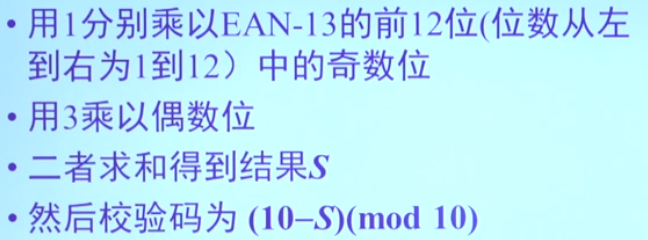

# 离散数学 1 基础知识

## 几何与序列

### 序列

**A***

**连接** $w_1$ o $w_2$

## 数论基础

$$
GCD(a, b) \cdot LCM(a, b) = a \cdot b
$$


### 欧几里得算法与裴蜀等式

**lemma**：
$$
a = qb + r \\
GCD(a, b) = GCD(b, r)
$$

```python
def euclidean_gcd(x, y):
    '''
    :param x: The larger num
    :param y: The smaller num
    :return: The greatest common denominator
    '''
    if y == 0:
        print(x)
    else:
        r = x % y
        return euclidean_gcd(y, r)
```

**裴蜀等式**：

对于不全为0的整数a, b, d，方程 $ sa + tb = d $ 存在整数解s和t，**当且仅当** GCD(a, b) | d

该等式称 **裴蜀（Bezout）等式**或**贝祖等式**

15s + 21t = 3：

最大公因子3，可以整除！有整数解。

### 同余

$$
n|(a-b)
$$

- a与b模n同余
- a mod n = b mod n
- a = b + kn

$$
a \equiv b \space (mod \space n),\space c \equiv d \space (mod \space n)
$$

有
$$
a \pm b \equiv c \pm d \space (mod \space n) \\
ac \equiv cb \space (mod \space n)
$$

### 基于模运算的校验码

条形码：EAN-13：前缀码（标志各会员组织的代码，如中国：690-695）、生产厂商代码（厂商识别码）、商品项目代码和校验码

新版国际标准书号ISBN-13

第二代身份证：最后一位也是校验码（ISO/IEC 7064:2003）

- 可以发现一个字符的错误
- 可以纠正一个已知位置的错误、
- 可以发现两个相邻字符的颠倒错误

## 计数基础

### 加法法则和乘法法则

### 排列

|          | 不重复选取 | 重复选取 |
| -------- | ---------- | -------- |
| 有序选取 | 排列       | 可重排列 |
| 无序选取 | 组合       | 可重组合 |

**n取r的排列**：$P(n, r)$ 当 r=n时，称**全排列**或**置换**

也即$|A| = n$时 A\*中长为r的各项彼此不同的串的个数。

**限制重复次数的可重排列**：可先认为相同的元素不同，再除以相同元素个数的阶乘。

### 组合

**n取r的组合**，子集称 **r-子集**：$C(n, r)$ 或 $\tbinom{n}{r}$

**可重组合**：转化隔板问题 $C(n + k - 1, k)$

### 鸽巢原理

也称 **狄利克雷抽屉原理**

**一般性鸽巢原理**

**推论**：m只鸽子住进n个巢，且$m-1=q\cdot n+r$，q，r整数，$0 \le r \lt n$，则至少有一个巢里有q+1只鸽子

*证明：边长为1的正六边形任意放置19个点，则必有两点距离不超过$\frac{\sqrt{3}}{3}$*

### 容斥原理

有限集A、B，则
$$
|A\cup B| = |A| + |B| - |A\cap B|
$$
容斥原理的推广

### 扩展

#### 汉诺塔

递归算法：

- 问题是否足够简单？
  - 简化为与自己类似的更简单的子问题（规模变小）
  - 足够简单时，直接解决
  - $T(n) = 2T(n-1) + 1 = 2^n - 1$

#### 斐波那契数列

总兔子 = 新生兔 + 上月兔
$$
f_n = N_n + O_n
$$

$$
O_n = f_{n-1}, \space N_n = f_{n-2}
$$

**应用**：

- 楼梯有n阶，每次可以跨1或2阶，求楼梯底端到顶端的不同方法数。
- 用2\*1的多米诺骨牌覆盖2\*n的棋盘，求覆盖方法数。

#### k阶常系数线性齐次递推关系

**特征方程和特征根**

利用韦达定理进行推导

#### 错排问题

n个元素的全排列中所有元素不在本来的位置上，称这个新的全排列是原排列的一个错排

也称**伯努利-欧拉错装信封问题**

**错排数 ** 或 **德·蒙特莫特数** 记作 $D(n)$ 或 $!n$

- 递推求解!n
- 容斥原理（至少有一个没有错排 = 一个没错排 - 两个没错排 + ...）

## 布尔矩阵

**位矩阵**：元素0或1

A的补： $\overline{A}$ 

A和B的并： $A \or B = C$

交： $A \and B = C$

**布尔积**： $A \bigodot B = C$

- 普通矩阵 
  $$
  A \times B = C = [c_{ij}] \\
  c_{ij} = \sum_k(a_{ik} \cdot b_{kj})
  $$

- 布尔矩阵
  $$
  A \odot B = C = [c_{ij}] \\
  c_{ij} = \or_k(a_{ik} \and b_{kj})
  $$

运算性质

- 交换律
- 结合律（布尔积也满足）
- 分配律
- 转置（布尔积也要颠倒AB次序）