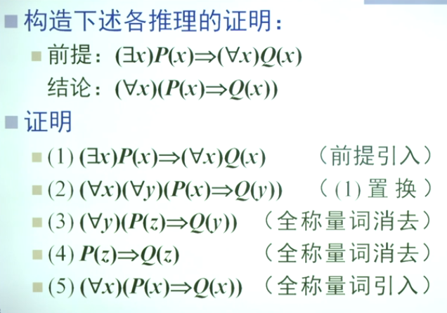

# 离散数学 3 谓词逻辑

## 谓词与量词

命题逻辑无法体现原子命题之间的逻辑！

**个体词**：命题里表示思维对象的词，表示独立存在的具体或抽象的客体

具体的、确定的个体词称为 **个体常项** ，一般用a,b,c表示

抽象的、不确定的个体词称为 **个体变项**，一般用x,y,z表示

个体变项的取值范围称作 **个体域** 或 **论域**

宇宙间一切事物组成的个体域称作 **全总个体域**

**谓词**：表示个体词性质或相互关系的词

**一元（目）谓词**：$Human(Socrates)$

**多元（目）谓词**：$Equal(x, y, z)$

谓词是命题形式而不是命题

**量词**：表示个体数量的词。给谓词加上量词称为谓词的**量化**

**全称量词**：$ \forall $

**存在量词**：$\exist$

## 谓词公式wff及其分类

也称 **合式公式** 简称 **公式**

谓词公式的 **解释**：

1. 非空的论域 D
2. D 中的一部分特定元素
3. D 上一些特定的函数
4. D 上的一些特定的谓词

谓词公式需要给出解释才能进行判断（命题公式需要一个真值指派）

若谓词公式A在任何解释下真值均为真，则A为 **普遍有效** 的公式或 **逻辑有效式**

**不可满足的** 公式或 **矛盾式**

**可满足的** 公式，逻辑有效式一定是可满足式

*注意：真值表是有限的，但解释可以是无限的*

**丘奇-图灵定理**：对任意一谓词公式而言，没有一个可行的方法判明它是否是普遍有效的。谓词逻辑是 **不可判定的** （但一些子类是可以判定的）

命题公式 $A_0$ 含命题变项 $p_1, p_2, \cdots, p_n$，用n个谓词逻辑 $A_1, A_2, \cdots, A_n$ 分别处处代换 $p_1, p_2, \cdots, p_n$ 所得公式 $A$ 是 $A_0$ 的 **代换实例**

**定理**：命题公式中重言式的代换实例都是逻辑有效式，在谓词公式中仍称为 **重言式** 。 矛盾式代换实例仍是 **矛盾式**

**子公式**

谓词公式A，$(\forall x)P(x)$ 或 $(\exist x)P(x)$ 为公式A的子公式

- 紧跟在 $\forall$ $\exist$ 之后的x称为量词的 **指导变项** 或 **作用变项**，$P(x)$称为相应量词的 **作用域** 或 **辖域**
- 辖域中x的一切出现均为 **约束出现** 受指导变项的约束
- 所有约束出现的变项称为 **约束变项**
- 在A中除了约束变项外出现的变项称为 **自由变项** 不受指导变项的约束

## 自然语句形式化

一般，“所有的A是B”、“是A的都是B”、“一切A都是B的”使用蕴含式，而不是合取式。“有的A是B”一般使用合取式而不是蕴含式。

例：存在唯一的偶素数
$$
\exist x((Prime(x) \and Even(x)) \and \forall y(Prime(y)\and Even(y) \rightarrow Equal(x, y)))
$$

## 谓词逻辑的等值演算

**等值**：在任何解释下，A和B的真值都相同

由于没有真值表，因此只能使用基本等值式，应用等值演算规则逐步推演

**基本等值式**

- 命题公式移植得到

- 谓词逻辑的特有等值式，与量词有关

  - **消去量词等值式**：论域D是有限集

  - **量词否定等值式/德·摩根律（否定符右移）** $\neg (\forall x)A(x) \equiv (\exist x)\neg A(x), \space \neg(\exist x)A(x) \equiv (\forall x)\neg A(x)$ 

  - **量词辖域的收缩和扩张等值式** 
    $$
    \forall x (A(x) \or B) \equiv \forall x A(x) \or B \\
    \forall x (A(x) \and B) \equiv \forall x A(x) \and B \\
    \exist x (A(x) \or B) \equiv \exist x A(x) \or B \\
    \exist x (A(x) \and B) \equiv \exist x A(x) \and B
    $$
    
  - **量词分配等值式** 
    $$
    \forall x(A(x) \and B(x)) \equiv \forall x A(x) \and \forall x B(x) \\
    \exist x (A(x) \or B(x)) \equiv \exist x A(x) \or \exist x B(x)
    $$
    *注意：* $\forall$ 对析取不满足分配律，$\exist$ 对合取不满足分配律
  
  - 多次量化且量化是同一类型的，可以任意交换次序

**等值演算规则**

- 置换规则
- 代替规则
  - 针对自由出现的个体变项的 **所有** 自由出现
- 换名规则
  - 针对量词的指导变项及其 **在辖域内的所有** 约束出现

**反驳和反例**
$$
\neg (\forall x (P(x) \rightarrow  Q(x))) \equiv (\exist x)(P(x) \and \neg Q(x))
$$

## 前束范式

- 所有量词位于公式最左
- 所有量词不含否定词
- 量词辖域延伸到整个公式末端

$$
Q_1x_1Q_2x_2 \cdots Q_nx_n M(x_1, x_2, \cdots, x_n)
$$

- $Q_i$ 为 $\forall$ 或 $\exist$
- $Q_1x_1Q_2x_2 \cdots Q_nx_n$ 称 **前束**
- $M$ 为不含量词的公式，称 **基式** 或 **母式**

**化前束范式的方法**

1. 消去联结词 $\rightarrow, \leftrightarrow$
2. 否定词右移
3. 谓词公式量词左移（必要时改名）

*注意：等值的前束范式不唯一*

**前束范式存在定理**：任何谓词公式都 **存在** 与之等值的前束范式，但其前束范式并不唯一

## 谓词逻辑的推理

仍采用 **蕴含式** 形式
$$
(H_1 \and H_2 \and \cdots H_n) \rightarrow C
$$
若为逻辑有效式，则称推理正确，C为前提 $H_i$ 的 **逻辑结论** 或 **有效结论**

**推理规则**：

- 全称推广规则/全称量词引入规则（UG）
  - $P(y)\rightarrow \forall x P(x) $
  - 要求：
    - P(y) 在任意个体变量y条件下为真
    - 取代自由出现的y的x **不能** 在P(y) 中约束出现
- 全称举例规则/全称量词消去规则（US）
  - $\forall x P(x) \rightarrow P(y)$ 或 $ \forall x P(x) \rightarrow P(a) $
  - 要求：
    - 取代x的y为任意的 **不** 在P(x)中约束出现的个体变项
    - a 可以为任意的个体常项
    - 取代时，须在x自由出现的一切地方进行取代
- 存在推广规则/存在量词引入规则（EG）
  - $P(a) \rightarrow \exist x P(x)$
  - 要求：
    - a是一个特定的个体常项
    -  v取代a的x **不在** P(a) 中出现
- 存在举例规则/存在量词消去规则（ES）
  - $\exist x P(x) \rightarrow P(a)$
  - 要求：
    - a是使P为真的特定的个体常项
    - a **不在** P(x) 中出现
    - P(x) 中 **无其它自由出现的个体变项**
    - a是在推导中 **未曾使用的**

**推理演算过程**：

1. 自然语句形式化
2. 若不能直接使用基本的推理公式则消去量词
3. 在无量词下使用规则和公式进行推理
4. 最后引入量词，得到结论

*注意：*

- 一般 **先使用存在量词消去规则** 再使用全称量词消去规则
- 使用 US, UG, ES, EG 规则，量词的 **辖域** **必须延伸到整个公式的末端**

