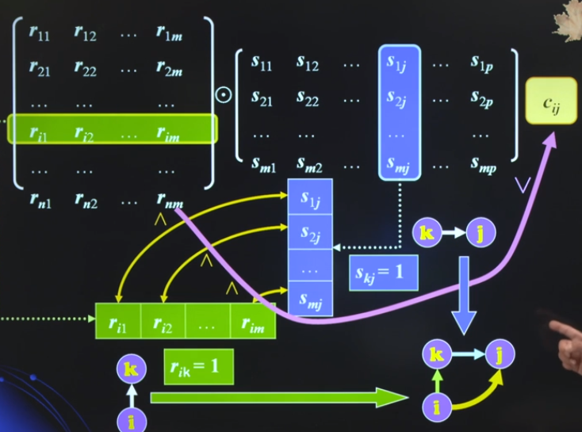
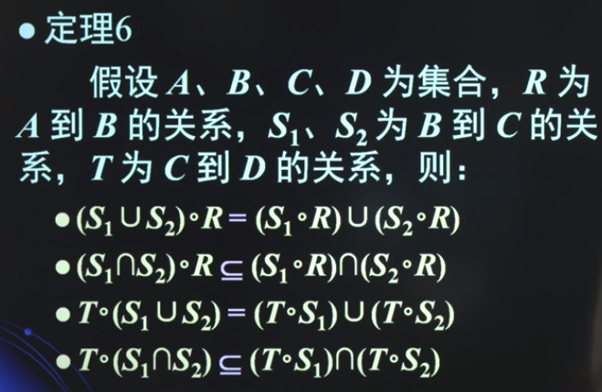
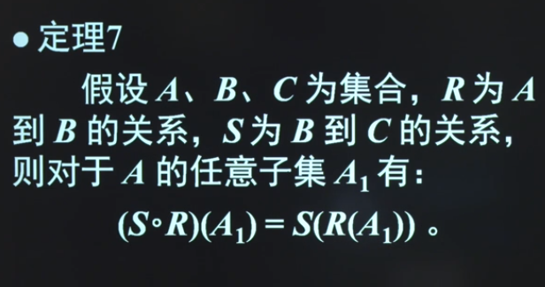
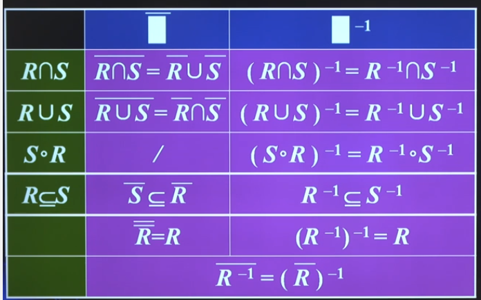
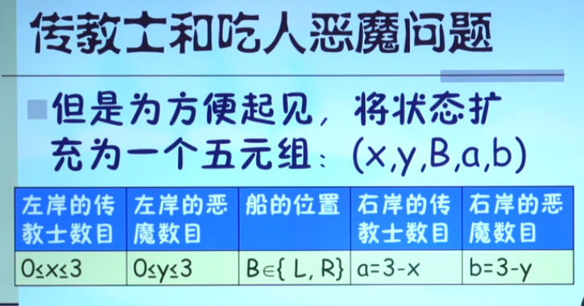
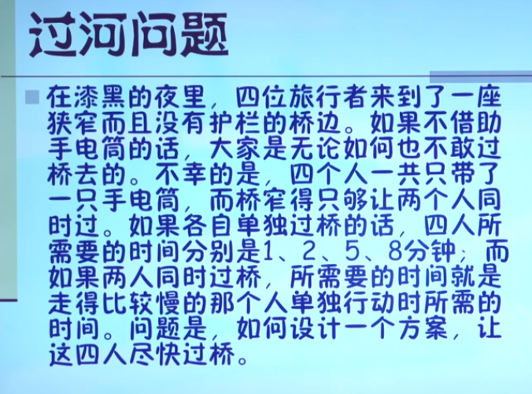

# 离散数学 4 二元关系

## 关系及其表示

### 有序对和笛卡尔积

**序**：两个对象a、b按一定次序组成的二元组称 **有序对** 或 **序偶**，记作 **(a, b)** a是 **第一元素/第一坐标** b是 **第二元素/第二坐标** 

**笛卡尔积**：$A \times B = \{(a, b)|a\in A \and b \in B\}$ 也称 **直积**

- $\Phi$ 的笛卡尔积还是空集
- 一般不满足交换律
- 平面直角坐标系是笛卡尔积 $R\times R$
- $|A \times B| = |A| \times |B|$
- 笛卡尔积对交或并运算 **满足分配率**
- m个集合笛卡尔积可以推广

选课问题：$\{张，白，宋，方\} \times \{离散，数据结构，计算机网络\} $

### 二元关系

实际的选课问题其实是这个笛卡尔积的 **一部分** 

**关系** ：集合A、B，$A\times B$ 的子集R称为 **A到B的一个二元关系**，简称为 **关系**

若 $R \subseteq A \times B$ 当$(a, b) \in R$，称 **a与b具有关系R** 记作 **aRb**，否则称 **a、b不具有关系R** 

若 A = B 则称R为 **A上** 的一个 **二元关系**

**常见的二元关系**：

- $\forall A$，可以在其幂集 $\frak{P}(\mathbb{A})$ 上定义 **包含关系**
  - $R_{\subseteq} = \{(x, y)|x \in {\frak{P}(\mathbb{A})} \and y \in {\scr{P}(\mathbb{A})} \and x \subseteq y \}$
- A是非零整数集的任一子集，则可以定义A上的整除关系为：
  - $D_A = \{(x, y)| x, y \in A \and x|y \}$
- B是石书记的任一子集，则可定义B上的 **小于等于关系** 为：
  - $L_B = \{(x, y) | x , y \in A \and x \leq y\}$

**限制**：假设A、B集合，$R \subseteq A \times B$ 是A到B的一个二元关系，$C \subseteq A$，则定义关系 **R在集合C上的限制** 为集合 $\{(a, b) | (a, b) \in R \and a \in C\}$ 简记为 $R|_C$


### 关系矩阵和关系图

定义R的关系矩阵为一个$m \times n$ 的布尔矩阵 $M_R = [r_{ij}]_{m \times n}$
$$
r_{ij} = \begin{cases}
1 & (a_i, b_j) \in R \\
0 & (a_i, b_j) \notin R
\end{cases}
$$
**关系图**

若 $(a_i, a_j) \in R$ ，则从顶点 $a_i$ 向顶点 $a_j$ 画一个箭头，称为 **有向边** 或 **边** ，若 $a_i = a_j$ 则称这条边为 **自环**

关系图是有向图

**二元关系的三种表示**：

- 笛卡尔积的子集
  - 有序对的集合
- 关系矩阵
- 有向图表示法
- （关系示意图）

### 定义域、值域与像集

集合A、B，$R \subseteq A \times B$ 是A到B的一个二元关系
$$
Dom(R) = \{a|a \in A, \exist b \in B \rightarrow (a, b) \in R\} \\
Ran(R) = \{b|b \in B, \exist a \in A \rightarrow (a, b) \in R\}
$$
**像集**

对于A中的任一元素x，定义x的像集
$$
R(x) = \{y \in B | xRy\}
$$
对于A的任一子集$A_1$，定义$A_1$ 的像集为
$$
R(A_1) = \{y\in B| xRy,对某一x\in A_1 成立\} \\
R(A_1) = \cup R(x)
$$
定义
$$
R(\Phi) = \Phi
$$
**关系相等判定定理**：集合A、B，R、S是A到B的二元关系，若对于所有 $a \in A$ 都有 $R(a) = S(a)$ 成立，则 $R = S$


## 关系的运算

### 关系的基本运算

二元关系R和S都是 $A \times B$ 的子集。集合运算适用于R和S

- 交
- 并
- 补：关系 $\overline{R}$ 定义为 $a\overline{R}b \iff a\not Rb $ 

**关系独有的运算**：

- **逆关系** $R^{-1} = \{(b, a)|b\in B, a \in A, (a, b) \in R\} \subseteq B \times A $
- **复合/合成关系** $S \circ R = \{(a, c)|a\in A, c \in C, \exist b((a, b) \in R \and (b, c)\in S ) \}$
  - 一般不满足交换律

**运算在关系矩阵和有向图中的特性**：

- 补
  - 关系矩阵相补
  - 叠合得到完整的关系图
- 逆
  - 关系矩阵发生转置
  - 有向图反向
- 交
- 并
- 复合关系
  - $M_{S \circ R} = M_R \odot M_S$ （布尔积）*是需要颠倒的！*
  - 

### 关系运算的性质

**定理1**：集合A、B，R、S是A到B的关系

- $Dom(R^{-1}) = Ran(R), Dom(R) = Ran(R^{-1})$
- $\overline{\overline{R}} = R$
- $(R^{-1})^{-1} = R$
- $\overline{R^{-1}} = (\overline{R})^{-1}$
- $(R\cap S)^{-1} = R^{-1} \cap S^{-1}, (R\cup S)^{-1} = R^{-1} \cup S^{-1}$ 利用关系矩阵进行证明
- 德摩·根律

**定理2**：A、B、C、D为非空集合，R为A到B的关系，S为B到C的关系，T为C到D的关系，则有：

- $T \circ (S \circ R) = (T \circ S) \circ R$ 利用关系矩阵证明（布尔积运算复合结合律）

**定理3**：

- $(S \circ R)^{-1} = R^{-1} \circ S^{-1}$

**定理4**：

- $若R \subseteq S，则R^{-1} \subseteq S^{-1}$
- $若R \subseteq S，则\overline{S} \subseteq \overline{R}$

**定理5**：集合A、B、C，$R_1、R_2$ 为A到B的关系，$S_1、S_2$ 为B到C的关系，$R_1\subseteq R_2, S_1\subseteq S_2$

- $S_1 \circ R_1 \subseteq S_2 \circ R_2$

**定理6**：

**定理7**：

这个定理可以帮助理解 **像集** ！证明两个包含于关系



### 关系的幂和道路

集合A上的关系R中从a到b **长为n的道路** 是A上有限序列$\pi: a, x_1, x_2, \cdots, x_{n-1}, b$

- $aRx_1$
- $x_iRx_{i+1}$
- $x_{n-1}Rb$

长度为n的道路包含n+1个顶点（可重复）

- n > 0 是道路的 **长度**
- a 是道路的 **起点**，b是道路的 **终点**
- 起点和终点相同的是 **回路**
- $\pi_1, \pi_2$ 的 **复合** 为道路 $\pi_2 \circ \pi_1 : a, x_1, \cdots, x_{n-1}, b, y_1, \cdots, y_{m-1}, c$

A上的关系 $R^n$ 为：$a, b \in A$ 则 $aR^nb$ 当且仅当存在R中从a到b长为n的道路

关系 $R^\infin$ 为：$a, b \in A$ 则 $aR^\infin b$ 当且仅当存在R中从a到b的道路

R的 **n次幂** 可以递归地定义：

- $R^0 = I_A$
  - $I_A$ 表示恒等关系
- $R^n = R^{n - 1} \circ R$

因此有：

- $M_{R^n} = M_R \odot M_R \cdots \odot M_R = (M_R)_{\odot^n} $
- $R^\infin = R \cup R^2 \cup R^3 \cdots \rightarrow M_{R^\infin} = M_R \or (M_R)_{\odot^2} \or (M_R)_{\odot^3} \cdots $
  - 定理：R是有限集A上的关系，$|A| = n$ 则有：
    - $R^\infin = R \cup R^2 \cup R^3 \cdots \cup R^n$
    - 证明：狄利克雷鸽巢原理，不断缩短道路

## 关系的性质

- 自反关系、非自反关系
  - “1个”元素
- 对称关系、非对称关系、分对称关系
  - “2个”元素
- 传递关系
  - “3个”元素

### 自反性

若 $(a, a) \in R$ 对所有 $a \in A$ 成立，则称R是 **自反的**，或称R **满足自反性**

- 主对角线元素为1
- 每个顶点都有自环

若 $(a, a) \notin R$ 对所有 $a \in A$ 成立，则称R是 **非自反的**，或称R **满足非自反性**

### 对称性

若 $\forall a, b \in A$ 如果 $(a, b) \in R \leftrightarrow (b, a) \in R$ 则R是 **对称的**，或称R **满足对称性**

- 关于主对角线对称
- 双向边

若 $\forall a, b \in A$ 如果 $(a, b) \in R \rightarrow (b, a) \notin R$ 则R是 **非对称的**，或称R **满足非对称性**

- $M_R \and M_R^T = 0$
- 两顶点之间最多一条有向边，无自环

若 $\forall a, b \in A$ 如果 $(a, b) \in R \and (b, a) \in R \leftrightarrow (b, a) \in R \and a = b$ 则R是 **反对称的**，或称R **满足反对称性**

- 也可表述为 $\forall a \forall b ((a, b) \in R \and a \neq b \rightarrow (b, a) \notin R)$
- 主对角线不做要求，其他对称位置相与必为0
- 两顶点之间最多一条有向边，可以有自环

保留对称关系的有向图的顶点，且所有有向边改为无向边，结果称为该关系的 **图**

### 传递性

**如果可以几步到，那么就可以一步到**

$\forall a, b, c \in A$ 若 $(a, b) \in R \and  (b, c) \in R \rightarrow (a, c) \in R$ 则称R是 **传递性的**，或 **满足传递关系**

何为 **不具传递性**？

$\neg \forall a \forall b \forall c ((a, b) \in R \and (b,c) \in R \rightarrow (a, c) \in R) \equiv \exist a \exist b \exist c ((a, b) \in R \and (b,c) \in R \and (a, c) \notin R)$

### 关系性质的判断


### 关系运算对性质的保持

**定理1自反性**：

- 逆运算保持自反
- 交、并、复合运算保持自反
- 非运算将自反转为非自反

**定理2对称性**：

- 逆运算和非运算保持对称
  - $(R \cap S)^-1 = R^{-1} \cap S^{-1} = R \cap S$
- 幂运算保持对称
- 交、并保持对称

**定理3传递性**：

- *引理* $(R\cap S)^2 = R^2 \cap S^2$
- 逆运算保持传递性
- 交保持传递性


### 特殊关系的计数

集合 $|A| = n$ ，那么在A上可以定义多少个不同的：

- 自反/非自反的关系
- 对称的/非对称的/反对称的关系

利用关系矩阵

## 关系的闭包

自然语言中有些特定的性质可以作为上下文的条件而往往略去不说。需要告诉程序这些特性。

- 关系的运算能生成新的关系，也可能是失去一些性质
- 有些关系“先天”缺少特定性质

$R_1$ 称为 $R$ 的关于某特定性质的 **闭包** 如果：

- $R \subseteq R_1$
- $R_1$ 具有所希望的性质
- $R_1$ 是A上满足上两条性质的 **最小** 关系

一般规定：

- **自反闭包** r(R)
  - $R \cup I_A$
  - 补上自环
- **对称闭包** s(R)
  - $R \cup R^{-1}$
  - 补上双向边
- **传递闭包** t(R)
  - $R^\infin$
  - 不断更新有向图：如果存在i到j的道路，就将(i, j)添加到有向图中，直至没有新的边可添加。

### 关系闭包具有的性质

**定理1**：

- R是自反的 iif r(R) = R
- R是对称的 iif s(R) = R
- R是传递的 iif t(R) = R

**定理2**：知 $R\subseteq S$

- $r(R) \subseteq r(S)$
- $s(R) \subseteq s(S)$
- $t(R) \subseteq t(S)$

**定理3**：

- 如果R自反，则s(R)和r(R)都自反
- 若果R对称，则r(R)和t(R)都对称
- 如果R传递，则r(R)传递
  - 对应定理4第三条！

**定理4**：

- $r(s(R)) = s(r(R))$
- $r(t(R)) = t(r(R))$
- $t(s(R)) \subseteq s(t(R))$

### 沃舍尔算法

用定义计算关系闭包时需要 (n-1)次布尔积和并运算，
$$
\Theta(n) = (n-1)(n^3 + n^2)
$$

```python
C = M_R
for k in range(n): # 中间过渡顶点
    for i in range(n):
        for j in range(n):
            C[i, j] = C[i, j] | (C[i, k] & C[k, j])
```

$$
\Theta(n) = 2n^3
$$

### 沃舍尔算法的纸笔计算

做n次，每次在第i行，第i列为1的地方画竖线和横线

## 等价关系和集合的划分

### 划分

集合A的非空子集的集合 $\scr{P}$ 称为A的一个 **划分** 或 **商集**，如果：

- A中的每一个元素都包含于 $\scr{P}$ 中的一个元素
- $\scr{P}$ 中的相异元素 $A_1, A_2$ 满足 $A_1 \cap A_2 = \Phi$

$\scr{P}$ 中的元素称为划分的 **划分块**

### 等价关系、等价类和商集

**等价关系**：非空集合A上的关系R满足 **自反、对称、传递**

- 关系矩阵为围绕主对角线的“1方块”

  

*例如：恒等关系，相似关系*

**等价类**：R是非空集合A上的等价关系，$a\in A$，集合R(a)称为a所在的等价类，也记作 $[a]_R$ 或 $[a]$

**商集**：$\{R(a)|a\in A\}$，记作 $A/R$，a称为R(a) 的 **代表元**

**定理**：$a, b \in A$，则aRb **iff** $R(a) = R(b)$

**定理**：等价关系R、S，则$R\cap S$ 也是等价关系

**定理**：包含$R\cup S$ 的最小等价关系为 $(R \cup S)^\infin$

### 由划分构造等价关系

 **定理：** 设 $\scr{P}$ 是集合A的一个划分，定义A上的关系R为：aRb iff a和b同属于一个划分块。则R是A上的一个等价关系。这个关系R称为 **由$\scr{P}$ 决定的等价关系**

### 由等价关系得到划分

**定理**：R是A上的一个等价关系，则 ${\scr{P}} = A/R = \{R(a)|a \in A\}$ 是A的一个划分，且R就是由 $\scr P$ 决定的等价关系。

**定理**：由划分与等价关系一一对应（由划分可以构造等价关系[上一节]，由等价关系可以得到划分[本节]）可得：$R_1, R_2$ 为非空集合A上的等价关系，则$R_1 = R_2$ iff $A/R_1 = A/R_2$

## 过河问题

人、狼、羊、菜过河问题。







思考：有权图？ 