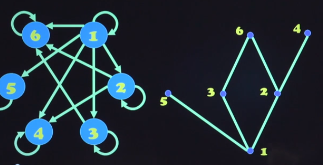

# 离散数学 6 偏序关系

## 偏序关系和偏序集

### 偏序集

设R是集合A上的关系，如果R是 **自反的**、**反对称的**、**传递的**，则称R是A上的一个 **偏序** 或 **半序** 关系，一般简记为 $\leq$ 或 $\geq$

集合A和偏序关系R构成的有序二元组 (A, R)称 **偏序集** 简记 **poset** 或 **半序集**

偏序集(A, R)， $a, b \in A$，如果有 $a \leq b$ 或 $b \leq a$ 成立，则称a，b是 **可比的**，否则是 **不可比的**

偏序集 (A, R) 对 $\forall a, b \in A$ ，a，b都是可比的，则称R为 **线序** 或 **全序**，(A, R)称 **线序集** 或 **全序集** 也称 **链**

若R为偏序，则 $R ^{-1}$ 也为偏序关系，称之为R的 **对偶**。偏序集 $ (A, R ^{-1}) $ 称为 偏序集 (A, R) 的 **对偶**

集合A上的关系R，若其是非自反和传递的，则称R是A上的一个 **拟序** 关系，一般简记为 < 或 >

**定理**：R是A上的关系

- 若R是一拟序关系，则 $r(R) = R \cup I_A$ 是一偏序关系
- 若R是一偏序关系，则 $R - I_A$ 是一拟序关系

### 积偏序与字典序

**定理**：$(A, \leq_1), (B, \leq_2)$ 是两个偏序集，则定义在 $A \times B$ 上的偏序关系 $\leq$ 为：$(a, b) \leq (a', b')$ 当且仅当 $a \leq_1 a' \and b \leq_2 b'$ 称之为 **积偏序**

设$(A, \leq_1), (B, \leq_2)$ 是两个偏序集，则定义在 $A \times B$ 上的偏序关系 $\prec$ 为： $(a, b) \prec (a', b')$ iff $a <_1 a \or (a = a' \and b \leq_2 b')$ 称为 **词典序** 或 **字典序**

词典序可以扩展到m个集合的笛卡尔积上：$(a_1, a_2, \cdots, a_m) \prec (a_1', a_2', \cdots, a_m')$

还可以将字典序扩展到 $S^*$ 上：设 $x = a_1a_2\cdots a_m, \space y = b_1b_2\cdots b_m$ 且 $k = \min(n, m)$，则 $x\prec y$ iff：

- $(a_1, a_2, \cdots, a_m) = (b_1, b_2, \cdots, b_n) \and n \leq m$ 或
- $(a_1, a_2, \cdots, a_k) \prec (b_1, b_2, \cdots, b_k) \and (a_1, a_2, \cdots, a_k) \neq(b_1, b_2, \cdots, b_k) $

两个全序集构成的积偏序不一定是全序集，但字典序一定是全序集。

### 哈斯图

**定理**：偏序集 $(A, \leq)$ 中的拟序集 $(A, <)$ 必不存在长度大于1的回路

画法：

- 删除自环
- 若aDb且不存在c使得aDc且cDb，则保留有向边(a, b)：传递性
- 重新组织有向边，使得各个有向边的方向 **朝上或斜上方**：不存在长度大于1的回路
- 顶点换成小圆点，标注元素名
- 

$(\{1, 2, 3, 4\}, \leq)$ 的哈斯图：


哈斯图只是表示 **有限** 偏序集的一种工具，诸如 $(\Z, \leq)$ **不能** 用哈斯图表示

## 偏序集中的特殊元素

### 极大元和极小元

偏序集$(A, \leq)$ 

- 若 $\exist x \in A$ 且不存在 $a \in A$ 使得 $x < a$ ，则 x 为 $(A, \leq)$ 的 **极大元**
- 若 $\exist x \in A$ 且不存在 $a \in A$ 使得 $x > a$ ，则 x 为 $(A, \leq)$ 的 **极小元**

孤立节点既是极大元，也是极小元。有时极大元、极小元可能不存在，如 $(\Z, \leq)$

**定理**：**有限** 偏序集一定存在极大元和极小元

极大元

- 不存在“更大的元素”
- 可能存在与之不可比的元素
- 可能不存在
- 可能不唯一

### 最大元和最小元

偏序集 $(A, \leq)$ 

- 若 $\exist x \in A$ 使得任意 $a \in A$ 都满足 $a \leq x$ 则称 x 为 $(A, \leq)$ 的 **最大元**，记作 I 或 1，称为 **幺元**
- 若 $\exist x \in A$ 使得任意 $a \in A$ 都满足 $a \geq x$ 则称 x 为 $(A, \leq)$ 的 **最小元**，记作 O 或 0，称为 **零元**

**定理**：任意偏序集中最多有一个最大元和最小元（利用反对称性证明）

### 上界与下界

偏序集 $(A, \leq), B\subseteq A$:

- 若 $\exist x \in A, \forall b \in B, b \leq x$ 称 x 为 B 的 **上界**
- 若 $\exist x \in A, \forall b \in B, b \geq x$ 称 x 为 B 的 **下界**

上/下界可能不存在，也不一定唯一，可能属于B也可能是不属于B

### 上确界与下确界

偏序集 $(A, \leq), B\subseteq A$，若元素x满足x是集合B的

- 上界且对于B的所有上界a都有 $x \leq a$，则称x为B的 **最小上界** 或 **上确界**，记作 **LUB(B)**
- 下界且对于B的所有上界a都有 $x \geq a$，则称x为B的 **最大下界** 或 **下确界**，记作 **GLB(B)**

**定理**：上/下确界若存在则必定唯一

即使存在上/下界，确界也不一定存在

### 拓扑排序

将有向图转化为哈斯图形式

有限偏序集 $(A, \leq)$ ，对其进行 **拓扑排序** 是指将其扩展成一个全序集 $(A, \prec)$ ，使得 $\leq \subseteq \prec$ ，即 $\forall a, b \in A$ 若 $a\leq b$ ，则 $a \prec b$

```pseudocode
function TopologicalSorting(A, R)
	B = A, S = R, Ls = A
	While |B| > 0 do
		从B中选择一个极小元x加入队列Ls
		B = B - {x}
		S = S|B S在集合B上的限制
	return Ls
```

## 格

偏序集 $(L, \leq)$ 若对于任意 $a, b \in L, \{a, b\}$ 都存在上确界和下确界，则称 $(L, \leq)$ 为一个 **格(lattice)** 

- 将LUB({a, b}) 记作 $a \or b$ 称为a和b的 **并**

- 将GLB({a, b}) 记作 $a\and b$ 称为a和b的 **交**

例如 $(\Z^+, |)$ 是一个格：

- $\forall x, y \in \Z^+, x\or y  = LCM(x, y), x\and y = GCD(x, y)$

又如集合S，则 $({\scr P}(S), \subseteq)$ 是格：

- $\forall A, B \in {\scr P}(S), A\or B = A\cup B, A\and B = A \cap B$

**定理**：设 $(L, \leq)$ 为格，则 $\forall a, b \in L$ 都有：

- $a\or b = b$ iff $a\leq b$
- $a\and b= a$ iff $a \leq b$
- $a\and b = a$ iff $a \or b = b$

由此可见，$\leq$ 关系可以由 $\or$ 和 $\and$ 来定义，于是 $(L, \leq)$ 也可写作 $(L, \or, \and)$。这种运算满足的性质与集合/命题逻辑相似。

**定理（格的保序性）**：$(L, \leq)$ 为格，$\forall a, b, c \in L$ 都有

- 若 $a \leq b$：$a \or c \leq b\or c, a\and c \leq b \and c$
- 若 $a \leq b \and c \leq d$：$a\or c \leq b \or d, a \and  c \leq b \and d$
- $a \leq c \and b \leq c \iff a \or b  \leq c$ 
- $c\leq a \and c\leq b \iff c \leq a \and b$

设 $(L, \or, \and)$ 是格，$S\subseteq L$ 且 S非空，若 $\forall a, b \in S$ 都有 $a\or b \in S 且 a\and b \in S$ 则称S为L的一个 **子格**

- $n|m$ 则 $(D_n, |)$ 是 $(D_m, |)$  的一个子格


右图是一个格，也是左图的一个子集，但不是左图的一个子格！

## 信息流的安全格模型

**信息流**：在空间和时间上向同一方向运动中的一组信息，具有共同的信息源和信息接受者

军用、政府系统中信息的流动 **严格** 受限：

- 上司只能接受下属报告，但不能告知下属
- 不同部门之间不能互相交流


不同权利范围用子集格 $L_1$ 表示

不同级别可用线性格 $L_2$ 表示

对权限的表述可用线性格和子集格的积表达：
$$
L_2 \times L_1
$$

- $(a, b) \preceq (c, d) \iff a \preceq c \and b \subseteq d$ 即 **同一部门且级别低**
- 在此条件下，信息可以从权限(a, b) 的主体流向权限为(c, d) 的主体

对于一般的信息流，可能不构成格。改造手段：

- 环可以收缩为一个权限
- 无上/下确界可认为添加

这样信息流模型与原来的是相同的。