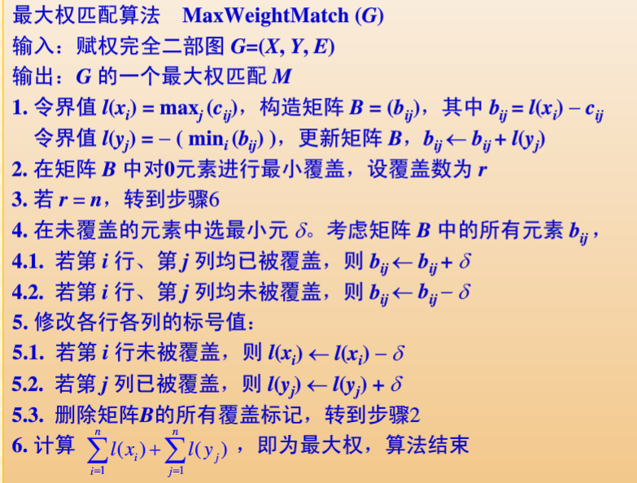
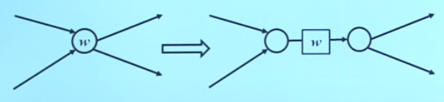

# 图论

## 图的基本概念

### 有向图和无向图

#### 无向图

一个 **无向图** G指一个三元组 $(V, E, \gamma)$ 其中：

- $V = \{v_1, v_2, \cdots, v_n\}$ 是一个有限集合，称作 **顶点集** ，其元素称作 **顶点** 或 **节点** $|V|$ 称为G的 **阶**
- $E = \{e_1, e_2, \cdots, e_m\}$ 是一个有限集合，称作 **边集** ，其元素称为 **边**
- $\gamma$ 是 $E$ 到 $V$ 的元素个数为1或2的全体子集的一个函数，即对于任意的 $e \in E$ 有 $\gamma(e) = \{u, v\} \in V$ (u,v) 可以不互异，此时u和v称作边e的 **端点**

若无特殊说明，约定用n表示图G的顶点数，m表示G的边数，一个边数为m的n阶图可简称为 **(n, m)-图**

假设 $G = (V, E, \gamma)$ 为无向图，$e \in E$，若 $\gamma(e) = \{u, v\}$ 则称 e 是u，v之间的一条边，称u和v是 **相邻顶点**，并称边e分别与u和v相 **关联**。若 u = v，称e是一个 **自环** 或简称 **环**

若G的两条边 $e_1, e_2$ 都与同一个顶点关联，则称 $e_1, e_2$ 是 **邻接的** 或 **相邻的**

若G中关联同一对顶点（允许相同）的边多于一条，则称这些边为 **重边** 或 **平行边**，这些边的条数称作重边的 **重数**

$v \in V$ 顶点v的 **度数** $deg(v)$ 是G中与v关联的边的数目（自环在计数时为2）。图G中最大的点度数和最小的点度数分别记为 $\Delta(G)$ 和 $\delta(G)$

G中

- 度数为0的顶点称为 **孤立顶点** 

- 图中度数为1的顶点称为 **悬挂点** 与悬挂点向关联的边称为 **悬挂边** 

- 图中度数为k的顶点称为 **k度点** 图中度数为计数的顶点称为 **积度点** 图中度数为偶数的顶点称为 **偶度点**

#### 简单图

不存在自环和重边的无向图称为 **简单图**

对于简单图，每条边可用顶点对唯一表示，因此可用 $\gamma(e)$ 表示 e

#### 有向图

一个 **有向图** 指一个三元组 $(V, E, \gamma)$ 其中

- $V = \{v_1, v_2, \cdots, v_n\}$
- $E = \{e_1, e_2, \cdots, e_m\}$
- $\gamma$ 是 $E$ 到 $V \times V$ 的一个函数，对于 $\forall e \in E$ 若 $\gamma(e) = (u, v) \in V \times V$ 则u称为边e的 **始点** v称为e的 **终点**

设 $G = (V, E, \gamma)$ 为有向图，$v \in V$，顶点v的 **入度** $deg^-(v)$ 是以v为终点的有向边的数目，**出度** $deg^+(v)$ 是以v为始点的有向边的数目，顶点v的 **度数** $deg(v) = deg^-(v) + deg^+(v)$

#### 赋权图

图 $G = (V, E, \gamma)$ 为图，W是E到$\R$ 的一个函数，则称 (G, W) 是一个 **赋权图**，对于 $e \in E, W(e)$ 称为边e的 **权重** 或简称 **权**

### 握手定理

**定理（图论基本命理、握手定理）**：无向图 $G = (V, E, \gamma)$ 则
$$
\sum_{v\in V}deg(v) = 2 |E|
$$
**推论**：奇数度的顶点数必然为偶数。

对于有向图 $G(V, E, \gamma)$ 有
$$
\sum_{v \in V}deg^+(v) = \sum_{v\in V}deg^-(v) = |E|
$$

### 特殊的图

无向图 $G(V, E, \gamma)$ 

#### 零图

若所有顶点都是孤立顶点，则G为 **零图** 或 **离散图**；若 $|V| = n, |E| = 0$ 则称G为 **n阶零图**

#### 正则图

所有顶点的度数均相等的图详图称为 **正则图**，所有顶点的度数均为k的正则图称为 **k度正则图**，也记作 **k-正则图**

- 零图是零度正则图

#### 完全图

任意两个相异顶点都相邻的简单图称为 **完全图**，n阶完全图记作 $K_n$

- $K_n$ 为 n-1度正则图
- 记 $V = \{1, 2, \cdots, n\}$ 则完全图的边集是 $E = \{\{u, v\}|1 \leq u < v \leq n\}$

#### 圈图

设 $V = \{1, 2, \cdots, n\} (n \geq 3), E = \{\{u, v\}|1 \leq u, v \leq n, u-v \equiv 1 \mod n)\}$ 则称简单图 $G(V, E)$ 为 **圈图** 记作 $C_n$

#### 立方体图

若图的顶点集V是由集合 {0, 1} 山的所有长为n的二进制串组成，两个定点邻接 iff 它们的标号序列仅在一位上数字不同。所形成的简单图称作 **n-立方体图** 记作 $Q_n$ 或 $B_n$ $n > 3$ 时，又称为 **n维超立方体图**

#### 二部图

若简单图 $G = (V, E)$ 顶点集V存在一个划分 $\{V_1, V_2\}$ 使得 G 中的任一条边的两端分属 $V_1, V_2$则称 G 是 **二部图** 或 **二分图** 写作 $G = (V_1, V_2, E)$

若 $V_1$ 中的每个顶点都与 $V_2$ 中的每个顶点相邻,则称G是 **完全二部图** 或 **完全二分图** 记作 $K_{r,s}$ 日中 $r = |V_1|, s = |V_2|, V_1, V_2$ 称作 G的 **互补顶点子集**

#### 轮图

一般记作 $W_n$：圈图里多个节点。

### 图的同构

$G_1 = (V_1, E_1, \gamma_1), G_2 = (V_2, E_2, \gamma_2)$ 是两个无向图,若:

- 存在 $V_1$ 到 $V_2$ 的双射 $f$
- 存在 $E_1$ 到 $E_2$ 的双射 $g$
- 满足 $\forall e \in E_1$，若 $\gamma_1(e) = \{u, v\}$ 则 $\gamma_2(g(e)) = \{f(u), f(v)\}$

则称 $G_1, G_2$ 是 **同构的** 记作 $G_1\cong G_2$

同构关系是一等价关系

### 子图与补图

#### 子图

$G = (V_1, E_1, \gamma_1)$ 和 $H = (V_2, E_2, \gamma_2)$ 是两个图，若满足 $V_2 \subseteq V_1, E_1 \subseteq E_2, \gamma_2 = \gamma_1|_{E_2}$ 即对于 $\forall e \in E_2, \gamma_2(e) = \gamma_1(e)$ 则称H是G的 **子图**

##### 生成子图

- $V_2 = V_1$ 称H是G的 **生成子图** 或 **支撑子图**

##### 真子图

- $E_2 \subset E_1 \or V_2 \subset V_1$ 时，称H是G的 **真子图**

##### 平凡子图

- $V_2 = V_1 \and (E_2 = E_1 \or E_2 = \Phi)$ H是G的 **平凡子图**

##### 导出子图

- 若 $E_2 = \{e|\gamma_1(e) = \{u, v\} \subseteq V_2\}$ 即 $E_2$ 包含了图G中 $V_2$ 之间的所有边，称H是G的 **导出子图** 

##### 删点子图和删边子图

**删点子图** 必然是导出子图

**删边子图** 必然是支撑子图

#### 补图

n阶简单图 $G = (V, E)$ ，令 $E' = \{\{u, v\} | u, v \in V, u \neq v, \{u, v\} \notin E\}$ 称 $(V, E')$ 为G的 **补图** 记作 $\overline{G}$

- 若 $G,\overline{G}$ 同构，则称G是 **自补图**
- n阶完全图 $ K_n$ 删除边集E后的图

### 道路、回路、连通性

有向图 $G = (V, E, \gamma)$ 

中的 **道路** $\pi$： 指一个点-边序列 $v_0, e_1, v_1, e_2, \cdots, v_{k-1}, e_k, v_k$ 满足对于所有 $i = 1, \cdots, k, \gamma(e_i) = (v_{i-1}, v_i)$ 称 $\pi$ 是从 $v_0$ 到 $v_k$ 的道路。若 $v_0 = v_k$ 则称 $\pi$ 是 **回路**。$v_0$ 是道路 $\pi$ 的 **起点**，$v_k$ 是 $\pi$ 的 **终点**，k称为 $\pi$ 的 **长度**

如果在道路/回路 $\pi$ 中各边互异，则称 $\pi$ 是 **简单道路** / **简单回路**

若在道路/回路 $\pi$ 中，除 $v_0$ 和 $v_k$ 外，图中每个顶点至多出现一次，则称 $\pi$ 是 **初级道路** / **初级回路**，初级回路也称 **圈**

> 所有结点互不相同(此时所有边也互不相同),则称该路为基本路真路.

无向图 $G(V, E, \gamma)$ 中的道路仅在于 $\gamma(e_i) = \{v_{i-1}, v_i\}$

简单图的每条边可以用顶点对唯一表示，道路也可以用顶点序列表示。

**定理**： 若简单图G中的每个顶点的度数都大于1，则G中存在回路

- 证明：设 $\pi:v_0, v_1, \cdots, v_k$ G中的一条初级道路

设u,v是图中的顶点，若u = v 或图中存在从u到v的道路，则称u到v时 **可达的** 否则称 u到v是 **不可达的**

- 可达性是无向图的顶点集上的一个等价关系

无向图G：

若图中任意两相异点之间都存在道路，则称G是 **连通的** 或 **连通图**，否则G是 **不连通的**

- 一阶简单图也是连通图

无向图G的顶点集V在可达关系下的等价类为 $\{V_1, V_2, \cdots, V_k\}$ 则G关于 $V_i$ 的导出子图称为G的一个 **连通分支**

连通图G，若 $e \in E$ 且 删边子图G-e不再连通，则称e是图G中的一条 **割边** 或 **桥**

对于有向图：

若忽略图中边的方向后得到的无向图是连通的，则称G为 **连通的** 或 **有向连通图**，否则称G是 **不连通的**

若任意两个顶点是双向可达的，则称G为 **强连通的**

若单向可达，则称G为 **单向联通的**

不存在有向回路，称为 **有向无环图(Directed Acyclic Graph)**，简记 **DAG**

### 图的矩阵表示

**邻接矩阵**
$$
a_{ij} = \begin{cases}
m & 存在m条 v_i到v_j的有向边 \\
0 & 其他
\end{cases}
$$

- A中第i行元素之和为顶点 $v_i$ 的出度
- A中第i列元素之和为顶点 $v_i$ 的入度
- A在普通乘法意义下的k次幂 $A^k$ 的 $a_{ij}$ 表示G中从 $v_j$ 到 $v_j$ 的长度为k的不同道路数目

无向图的邻接矩阵可用相邻类似定义。

- $A ^ T = A$
- 其他与有向图邻接矩阵性质类似

对于二部图 $G = (X, Y, E)$ 还可用矩阵形式表示。

## 欧拉图

### 欧拉道路与欧拉回路

哥尼斯堡七桥问题

**欧拉道路**：经过G中每条边一次且仅一次的道路

**欧拉回路**：类似的回路

**欧拉图**：存在欧拉回路的图

**定理：**

- 无向图G是欧拉图 iff G是连通的而且所有顶点都是偶数度
  - 必要性：一进一出偶数度
  - 充分性：任一点出发，构造G的一条简单回路C
    - 若C不是G的欧拉回路则从G中删去C的各边，删去孤立顶点，得到 $G_1$ 显然其中各顶点的度仍然是偶数
    - 由于原图是连通的，$G_1$ 和 $C$ 必然有公共点u
    - 从u出发，在 $G_1$ 中得到回路 $C'$
    - C和C'连接起来，得到了一条更长的简单回路。这个过程不能无限进行
- 无向图存在欧拉道路 iff G是连通的且G中的奇数度顶点不超过两个
  - 在两个奇数度的顶点上添加一个虚拟边，转成上一个定理。最后再把此边删去。

### 弗勒里算法

尽量不选择 **桥**

## 哈密尔顿图

### 哈密尔顿道路和哈密尔顿回路

经过图G中每个顶点一次且仅一次的道路称为该图的一条 **哈密尔顿道路**

经过图G中每个顶点一次且仅一次的回路为 **哈密尔顿回路**

存在哈密尔顿回路的图称为 **哈密尔顿图**

哈密尔顿图的存在和构造问题异常复杂，是最早被证明 **NPC** 的问题之一，至今尚未解决。

### 哈密尔顿图的刻画

哈密尔顿图不存在悬挂边

存在哈密尔顿道路的图中不存在孤立顶点

$n > 2$ 时，$K_n$ 是哈密尔顿图

- 任意一个全排列都对应一个哈密尔顿回路

只要G中有“足够多”的边，那么它就是哈密尔顿图

**定理**：

- 设G是n $(n \geq 2)$ 阶简单图，若G中任意一对顶点u和v，都满足 $deg(u) + deg(v) \geq n - 1$ 则G中存在哈密尔顿道路

- 设G是n $(n \geq 3)$ 阶简单图，若G中任意一对顶点u和v，都满足 $deg(u) + deg(v) \geq n $ 则G为哈密尔顿图
  
- > 哈密顿图去掉n个点，余下图的连通分支个数不得超越n
  
  - 推论：G是n $(n \geq 3)$ 阶简单图，若G中任一顶点的度数都至少是n/2则G是哈密尔顿图
  - 推论：(n, m)若满足 $m \geq \frac{n^2 - 3n + 6}{2}$ 则G是哈密尔顿图（利用删点子图反证）

### 骑士巡游问题

细分为骑士巡游道路和骑士巡游回路问题

**断言**：除以下三种情况外，(m*n)棋盘上都存在骑士巡游回路：

- m、n为奇数且 $n \neq 1$
- m = 1、2、4
- m = 3 且 n = 4、6、8

构造算法依然是一个活跃的课题

### 旅行商问题

找出赋权完全图的权值和最小的哈密尔顿回路。

也是一个NPC难题。设计高效的近似算法和优化理论依然是算法学的研究热点。

## 平面图

若可以将无向图G 画在平面上，使得除端点之外，各边彼此不相交 则称G是 **具有平面性的图**，或简称 **平面图** 。否则G是 **非平面图**

在设计电路时，一定要避免产生导线的交叉。

设计城市时，减少道路交叉。建桥是图的分层问题。

### 欧拉公式

若G是平面图，G的边将平面划分成若干个封闭区域，称G的 **面**，包围面的边称为该面的 **边界**。面的边界中的边数称为面的 **次数** （桥在计数时作为算作两条边）

- 若一条边不是桥，则一定是两个面的公共边界
- 桥只能是一个面的边界
- 两个以一条边为公共边界的面称为 **相邻的面**

**定理**：平面图G的所有面的次数之和等于边数的两倍

**欧拉公式**：G是一个面数为f的 (n, m)-连通平面图，则：
$$
n - m + f = 2
$$
其证明可用数学归纳法。

**推论**：G是一个面数为f的(n, m)-平面图，且有l个连通分支，则
$$
n-m+f = l + 1
$$
**定理2**：G是一个面数为f的 (n, m)-连通简单平面图，$n \geq 3$ 每个面的次数至少是l，则
$$
l \times f \leq 2m \\
m \leq \frac{(n - 2) \times l}{l-2}
$$
**推论**：易知 $l \geq 3$
$$
m \leq 3n-6
$$
**推论**：任何简单连通平面图中，至少存在一个度数不超过5的顶点

#### 应用

可以利用两个定理推出的不等式判断平面图

### 对偶图

可见专题部分

**定理**：

- 平面图G的对偶图G\*也是平面图，而且是连通的
- 满足
  - n = f\*
  - m = m\*
  - f = n\*
  - 若面f对应于顶点v\*，则f的次数等于v\*的度数

### 库拉托夫斯基定理

也即平面图判定定理

$G = (V, E, \gamma)$ 是无向图，$e\in E$ 顶点u和v是e的两端，e的 **细分** 是指在G中增加一个顶点w，删去边e，在增加以u、w为端点的边 $e_1$ 及以w和v为顶点的边 $e_2$。这两个图 **同胚**。

图的细分就是对其边做若干次细分得到的结果。

一个图的子图不是平面图，则这个图必然也不是平面图。

**定理**：一个无向图是平面图 iff 它不包含与 $K_5$ 或 $K_{3, 3}$ 的细分同构的子图

## 顶点支配、独立与覆盖

### 支配集

应用背景：分布式系统中，希望所有节点都要存放计算服务器，有些节点还需要存放数据服务器。希望找到一种最俭省的部署方法，使得每个计算服务器都可以连接到数据服务器。

无向图简单图 $G = (V, E), D\subseteq V$ 

- 若对于 $\forall v \in V - D, u\in D$ 使得 $uv \in E$ 则称D为一个 **支配集** 
- 若D是图G的支配集，且D的任何真子集都不再是支配集，则称D为一个 **极小支配集**
- 若G的支配集D满足对G的任何支配集D'都有 $|D| \leq |D'|$ 则称D是G的一个 **最小支配集**
  - 其中袁术称作图G的 **支配数** 记作 $\gamma(G)$

结论：

- V中的顶点要么属于支配集，要么与支配集中的一个元素相邻
- 一个图中的极小/最小支配集可能不唯一

### 点独立集

应用背景：通信系统中，会出现传输干扰，输入和输出可能不同

无向图 $G = (V, E, \gamma), S\subseteq V$ 

- 若 $\forall u, v \in S$ 都存在不相邻的u和v，则称S是G的一个 **点独立集** 或简称 **独立集**
  - 空集是任意图的点独立集
- 若对G的任何独立集T，$S \not \subset T$ 则称S是G的一个 **极大独立集**
- 其中基数最大的称 **最大独立集**
  - 此最大基数称为G的 **独立数**，记作 $\alpha(G)$

结论：

- 极大独立集不是其他然和点独立集的子集
- 若点独立集S是G的一个极大独立集，则对于任意 $u \in V - S$ 都存在 $v \in S$ 使得 uv相邻
- 极大独立集和最大独立集可能不唯一

独立集和支配数之间的关系：

**定理**：

- 一个独立集也是支配集 iff 它是极大独立集
- 无项简单图的极大独立集都是极小支配集，反之不真
  - $\alpha (G) \geq \gamma(G)$

### 点覆盖集

简单图 $G = (V, E), V^* \subseteq V $ 

- 若对于 $\forall e \in E, \exists v \in V$ 使得v是e的一个端点，则称V*是G的一个 **点覆盖集**，简称 **点覆盖**
- 若V\*是图G的点覆盖，且V\*的任何真子集都不再是点覆盖，则称V\*为一个 **极小点覆盖**
- 其中基数最小的称为 **最小点覆盖**
  - 此最小点覆盖元素数称作G 的 **点覆盖数**，记作 $\beta(G)$

结论：

- 在极小点覆盖中，不存在所有相邻顶点都属于V\*的顶点
- 极小点覆盖，最小点覆盖可能不唯一
- 明显有 $\beta(G) \geq \gamma (G)$：覆盖所有边就一定可以支配所有点

**定理**：

- 简单图 $G(V, E)$ 中 $V^* \subseteq V$ 是点覆盖集 iff $V - V^*$ 是独立集

**推论**：

- 简单图 $G(V, E)$ 中 $V^* \subseteq V$ 是极小点覆盖集 iff $V - V^*$ 是极大独立集
- 简单图 $G(V, E)$ 中 $V^* \subseteq V$ 是最小点覆盖集 iff $V - V^*$ 是最大独立集，且有 $\alpha(G) + \beta(G) = |V|$ 

## 图的着色

给简单图G的每个顶点赋予一种颜色，使得 **相邻的顶点颜色不同**，称为图G的一种 **点着色**

对简单图G进行点着色所需要的最少颜色数目，称为G的 **点色数** 记作 $\chi(G)$

对于n阶简单图G，$\chi(G) \leq n$

类似可以定义 **边着色** 和 **面着色**

利用对偶图，可以将平面图G的面着色问题变为对偶图 $G*$ 的点着色问题

利用 **线图** 概念，可以将图的边着色变为点着色问题

构造图 $L(G)$，G中的边和L(G) 中的顶点一一对应，如果G中的边 $e_1, e_2$ 相邻，则在L(G) 中与 $e_1, e_2$ 相对应的两个顶点间连一条边，称L(G) 是G的 **线图**

图G的点着色可以确定其顶点上的顶点集 V 上的一个二元关系R

- $(u, v)\in R \iff u,v$ 着同色 
- 由此得到的V的一个划分，每个划分块都是一个点的独立集
- 由点的独立集的一个划分，也可以确定G的一种点着色法
  - 图G的色数就是将顶点集V关于独立集做划分时，划分块为最少的时数目

觉得图的色数是一个NP完全问题。

> 一个图着色所需的颜色数目一定大于其子图。可以通过寻找完全图判断其至少需要几种颜色进行染色。
>
> $\chi(K_n) = n$
>
> $\chi(C_n) = 2 \space or \space 3$

### 韦尔奇-鲍威尔算法

按度不增排序，取一种颜色，从头开始染色，若相邻则跳过。已着色的踢出序列，直到序列为空。

### 四色定理

平面图只需4中颜色进行着色。

哈密尔顿图和面着色之间的关系：

- 哈密尔顿回路将平面分为若干回路内部面和外部面
- A、B交替为内部面着色
- C、D交替为外部面着色
- 一般，每个平面哈密尔顿图可以用4中颜色进行面着色

### 拉姆齐数

任意6个人中必定有三人彼此相识或3人彼此不相识。

一般形式：整数s、t，计算最小整数n，使得任意n个人必定有s个人彼此相识或t个人互不相识

图论表述：整数s、t，计算最小整数n，使得对n阶完全图的边任意染红色或蓝色后，图中都一定存在红色s阶完全图子图或蓝色t阶完全图子图。

**拉姆齐数**：$R(s, t)$

**拉姆齐定理**：只要完全图足够大，对任意边染以红蓝两色之一，其中一定包含所要求大小的同色完全图子图。

对拉姆齐数的计算非常困难。

## 顿时错乱游戏

## 中国邮路问题

## 抽芽游戏

**策梅洛定理**：二人游戏如果满足：

- 游戏步骤有限
- 信息完备
- 不会产生平局
- 确定性

必然存在先手或后手必胜策略。

## 抱子甘蓝游戏

# 图论进阶

## 匹配

与点独立集相对应，现考虑不相邻的边，其本质是将顶点两两匹配。

设 $G = (V, E)$ 是简单图 $M \subseteq E$ 若M中的任何两条边都不邻接，称M为G的一个 **匹配** 或 **边独立集**

设顶点 $v \in V$ 若存在 $e \in M$ 使得v是e的一个端点，则称v是 **M-饱和的** 否则称v是 **M-非饱和的**

若匹配M满足对 $\forall e \in E - M, M \cup \{e\}$ 不再构成匹配，则称G为一个 **极大匹配**

若G的匹配M满足对于G的任何匹配 $M'$ 都有 $|M| \geq |M'|$ 则称M是G的一个 **最大基数匹配** 或 **最大匹配**

最大匹配M的元素数称作图G的 **匹配数** 记作 $v(G)$

饱和图G中每个顶点的匹配称 **完全匹配** 或 **完美匹配** （所有顶点都进行两两配对）

*注意：*

- 极大匹配不是其它任何匹配的子集
- 若匹配M是G的一个极大匹配，则 $\forall e \in E - M, \exist e_1 \in M$ 使得 $e$ 与 $e_1$ 相邻
- 极大匹配可不唯一
- 最大匹配可不唯一
- 最大匹配来自极大匹配
- 匹配数不会超过G的阶数的一半
- 若G存在完美匹配，则G的匹配数为G的阶数的一半，此时的阶数为偶数
- 完美匹配是最大匹配，但最大匹配未必是完美匹配（可能不存在）

特殊图的匹配数：

- $K_n(n\geq 3):\lfloor n/2\rfloor$ 
- $K_{m, n}:\min{(m, n)}$
- $C_n(n \geq 3):\lfloor n/2\rfloor$

### 波奇引理(Berge's lemma)

M是G中的一个匹配，若G中的一条初级道路是M中边的E-M中边交替出现组成的，则称其为 **交替道路**。若一条交错道路的始点和终点都是M-非饱和顶点，则称其为 **M-可增广道路**

- 可增广道路的长度一定为奇数

**波奇引理**：匹配M是G的最大匹配 **iff** G中不存在M-可增广道路。

- 必要性：若存在可增广道路，则一定不是最大匹配
- 充分性：设不存在M-可增广道路但M不是最大匹配。则必然存在最大匹配 $M'$。将其与M的边做异或，观察知这样一定可以得到一个可增广道路，与假设矛盾。

### 最大匹配构造算法（二部图）

从任意初始匹配，寻找可增广道路，直至不能再扩大

**邻接顶点集**：W是图G的顶点集的一个子集 $N_G(W) = \{v|\exist u \in W, v,u相邻\}$

### 霍尔定理

**霍尔婚配定理**：$G = (X, Y, E)$ 是二部图，G中存在饱和X中每个顶点的匹配M ($|M| = |X|$) **iff** $\forall S \neq \Phi, S\subseteq X, |N_G(S)| \geq |S|$

- 任意子集S都有足够多的相邻顶点

**推论**：

- 二部图 $G = (X, Y, E)$，若存在 $k \in \Z^+$ 使得 $\forall x \in X, deg(x) \geq k, \forall y \in Y, deg(y) \leq k$ 则G中存在饱和X中每个顶点的匹配
- $\forall k \in \Z^+$，k-正则二部图中必定存在饱和X中每个节点的匹配
  - 若一次集体相亲活动中有n个男孩和n个女孩，任意k名男孩在一起认识的女孩至少k人，则一定可以安排得当使得每位都有认识的人约会。

### 拉丁方

每行每列都包含给定的n个符号恰一次的 $n\times n$ 矩阵为 **拉丁方**

**拉丁方的生成**：

1. 构造完全二部图 $K_{n, n} = (S, C, E)$ 其中 $C = \{c_1, c_2, \cdots, c_n\}, c_i (1\leq i \leq n)$ 的含义为第i列
2. 完全二部图 $K_{n, n}$ 是n正则二部图，存在完全匹配 $M_1$ 。将其中的每条边属于X中顶点的标号分别作为第1含的元素，也即 $c_1$ 在 $M_1$ 下配对的顶点的标号作为第1含的第1列元素，$c_2$ 在 $M_1$ 下配对的顶点的标号作为第1行第2列元素……得到矩阵第一行。
3. 令 $E \leftarrow E - M_1, (S, C, E)$ 是n-1正则二部图，存在完全匹配 $M_2$ ，产生矩阵第二行。
4. 以此类推，知道E变为空集，得到拉丁方

> 注意：这个过程本质上是不断寻找完全匹配的过程。每找到一个完全匹配，就将其作为一行，然后在图中删去这一匹配。再寻找新的匹配。寻找匹配的方法可以由最大匹配构造算法解决。

### 边覆盖集

> 边覆盖集覆盖点，点覆盖集覆盖边。
>
> 完全匹配比最小边覆盖范围小一点点。

$G$ 是无孤立顶点的简单图，$E^* \subseteq E$ 

- 若对于 $\forall v \in V, \exist e \in E^*$ 使得v是e的一个端点，则称 $E^*$ 为G的一个边覆盖集，简称 **边覆盖**
- 若 $E^*$ 是图G的边覆盖，且 $E^*$ 的任何真子集都不再是边覆盖，则称 $E^*$ 为一个 **极小边覆盖**
- 若G的边覆盖 $E^*$ 满足对于G的任意边覆盖 $E'$ 都有 $|E^*| \leq |E'|$ 则称 $E^*$ 为G的一个 **最小边覆盖**
- 最小边覆盖 $E^*$ 的元素称为图G的 **边覆盖数** 记作 $\rho(G)$

*注意*：

- 含有孤立顶点的简单图不存在边覆盖
- 极小边覆盖中的任何一条边的两个顶点不可能与其中的其他边关联
- $\rho(G) \geq |V| / 2$
- 极小边覆盖可不唯一
- 最小边覆盖可不唯一
- 最小边覆盖源自极小边覆盖

**特殊图的边覆盖**：

- 完美匹配是最小边覆盖
- $K_n(n\geq 3)$ 中边覆盖数 $\rho(G) = \lceil n/2 \rceil$
- $K_{m, n}$ 的边覆盖数 $\rho(G) = \max{(m, n)}$
- $C_n$ 的边覆盖数 $\rho(G) = \lceil n/2 \rceil$

**定理**：G是没有孤立顶点的简单图，M为G的一个匹配，N为G的一个边覆盖，则
$$
|N| \geq \rho(G) \geq |V| / 2 \geq v(G) \geq |M|
$$
当M为G的一个完美匹配，N为G的最小覆盖时，等号成立

**定理**：G为无孤立顶点的而简单图

- M为G的一个最大匹配，对G中每一个M-非饱和顶点均取一条与其关联的边，组成集合N，则 $M\cup N$ 构成G的一个最小边覆盖。
- N为G的一个最小边覆盖，若N存在相邻的边则移去其中一条，直至不存在相邻的边为止，构成的边集M为G的一个最大匹配。
- $\rho(G) + v(G) = |V|$

### 柯尼希-艾盖尔瓦里定理

> 二部图中点覆盖与匹配之间的关系。
>

**定理**：K为无孤立顶点的简单图G的任意一个点覆盖集，M为G的任意一个匹配，则 $|M| \leq |K|, v(G)\leq \beta(G)$ 

> 匹配集是边集的子集，既然每条边都有一个点对应，那么匹配集中的边自然也能找到对应的点。而且由于其特殊性，这个点是两两不同的。

**推论**：假设K为没有孤立顶点的简单图G的任意一个点覆盖集。M为G的任意一个匹配，若 $|M| = |K|$ 则M为一个最大匹配，K为一个最小匹覆盖

**柯尼希-埃盖尔瓦里定理**：二部图中最大匹配的边数等于最小点覆盖数的顶点数

从逻辑代数角度来看，可以：

- 定义布尔矩阵的 **覆盖** 为：选择矩阵中的某些行和列，这些行和列包含了矩阵中所有非零元。能覆盖全部非零元的最少行、列之和为 **最小覆盖数**，记作 $S$

- 对于 $m\times n$ 的布尔矩阵，盖住全部m行或n列，一定盖住所有非零元，因此 $S \leq \min(m, n)$

- 每个布尔矩阵可以视作二部图的矩阵形式，每个覆盖对应二部图的一个点覆盖

- $m\times n$ 的布尔矩阵的 **秩** 为矩阵中不在同行同列的1元素的最大个数，其秩小于 $\min(m, n)$ 且二部图的矩阵形式的秩就是最大匹配数。

- **柯尼希-埃盖尔瓦里定理**可以等价表述为：布尔矩阵的秩等于其最小覆盖数

- 

- > $X_c$ 到 $Y - Y_d$ 有饱和 $X_c$中每个顶点的匹配（左上角必有1存在，否则 $X_c$ 就会被划归 $Y_d$ 了），$Y_d$ 到 $X - X_c$ 也有饱和 $Y_d$ 中每个顶点的匹配。

由最大匹配M构造最小点覆盖集合的方法：

1. X中不存在M-非饱和顶点，则X本身就是一个最小点覆盖集

2. 否则

   1. 考虑M-非饱和顶点 $x\in X$，记Y中所有通过中x开始的交错道路可以到达的顶点集合为 $Y_x$

   2. 对于所有M-非饱和顶点 $x\in X$，记所有 $Y_x$ 的并为 $Y_1$

      > $Y_1$ 中的顶点可以覆盖非饱和顶点引出的边，以及一部分M中的边

   3. 记M中与 $Y_1$ 中的元素相关联的边集为 $M_1$

   4. 记X中与 $M - M_1$ 相关联的顶点集合为 $X_1$

      > M中剩下的边可以被这些点覆盖。

   5. 则 $Y_1 \cup X_1$ 为一个最小点覆盖集

### 二部图最佳匹配问题

在二部图中引入权值。

例如，不同工人和工作之间形成二部图，效益为边权值，要让每个人有事可做，且效益最高，寻找这样的权值最大的最大匹配。

模型中边的权值称为 **代价**，最大或最小的权值总和称为 **最优值**，这样的完全匹配称为 **最佳匹配**

形式化表述为：$G = (X, Y, E)$ 为赋权 **完全二部图**，其中 $X = \{x_1, x_2, \cdots, x_n\}, Y = \{y_1, y_2, \cdots, y_n\}$ 边 $x_iy_j$ 的权值记作 $c(i, j)$ 或 $c_{ij}$。假定权值都是非负整数。则最优值为
$$
\max(\sum_{i = 1}^nc(i, j_i))\space 或 \space \min(\sum_{i = 1}^nc(i, j_i))
$$
其中 $j_1, j_2, \cdots, j_n$ 构成1~n的一个置换。

> 注意：在这个问题中，有n个工人和n个工作。在这种情况下，寻找最大匹配其实也就是寻找最小边覆盖集。

KM算法可以解决此问题。

算法如下：

## 流网络

### 流网络

$G = (V, E)$ 是一个连通无重边且不包含自环的有向图。若G中：

- 只有一个入度为0的顶点，记作s，称为 **源**
- 只有一个出度为0的顶点，记作t，称为 **汇**
- 每条有向边 $e = (u, v)$ 都存在一个非负的权值 $c_{uv}$，称为边的 **容量**

则G为一个 **网络** 或 **流网络**，也记作 $G = (V, E, s, t, c)$

- 有向边也称为 **弧**，边 $e = (u, v)$ 通常也记作 $uv$

注意：若有重边，也可以将其容量归入一条边。有无自环也不影响水流或数据流的的整体流动。

若实际应用中需要考虑中转站容量，则可以添加一条额外的边：

若有多个源或多个汇，可以将网络中N扩大到N'，转化为单源单汇的网络N'中的最大流问题：

- 增加两个新顶点s、t
- 添加s到每个源的有向边、t到每个汇的有向边
- 将足够大的容量 $c_0$ 赋给这些新增的有向边（大于每个源发出边的容量之和即可）
- 称s为 **超源**
- 称t为 **超汇**

假设网络 $G = (V, E, s, t, c)$，定义顶点 $v\in V$ 的 **前驱** 为 $pred(v) = \{u|(u, v)\in E\}$ **后继** 为 $succ(v) = \{u|(v, u)\in E\}$

#### 流分布

若实值函数 $f:E \rightarrow \R$ 满足：

1. 容量限制：$\forall e = (u, v) \in E, f_{uv} = f(e) \leq c_{uv}$
2. 流量守恒：$\forall v \in V - \{s, t\}, \sum_{u\in pred(v)}f_{uv} = \sum_{u\in succ(v)}f_{vu}$
   - 流量守恒表明，除了源和汇两个顶点，总流入量等于总流出量，不产生、不消耗。

- 称其为网络的一个 **容许流分布**，或简称为一个 **流**，$f_{uv}$ 称为边 $(u, v)$ 的 **流量**

- 若 $e = (u, v), f_{uv} = c_{uv}$ 则称e为 **饱和边**

- $\forall v \in V - \{s\}$ 定义 $f(\cdot, v) = \sum_{u\in pred(v)}f_{uv}$ 为顶点v的 **总流入量**

- $\forall u \in V - \{t\}$ 定义 $f(u, \cdot) = \sum_{v\in succ(u)}f_{uv}$ 为顶点v的 **总流出量**

- 设f是网络图G的一个流，$f(s, \cdot)$ 称作流f的 **流量** 或 **值**，即源s的总流出量，记作 $|f|$

- 若G任意一个流 $f'$ 都满足 $|f| \geq |f'|$ 则称f是G的一个 **最大流**。 

- 一般，最大流不唯一。

### 剩余图和可增广道路

网络 $G = (V, E, s, t, c)$ 中有流 $f$，则G关于f的 **剩余图** 为 $G_f(V, E_f, s, t, c')$：

- 顶点集相同，源和汇相同

- $G_f$ 的边集有两类：

  - $\{(u, v)|f_{uv}< c_{uv}\}$ 称为 **前向边**
  - $\{(u, v)|f_{vu}> 0\}$ 称为 **后向边**
  - 饱和边没有前向边，只有后向边
  - 总结为 $E_f = \{(u, v)|f_{uv}<c_{uv} 或 f_{vu} > 0\}$

- 容量 
  $$
  c_{uv}' = \begin{cases}
  c_{uv} - f_{uv},  & f_{uv} < c_{uv} \\
  f_{vu}, & f_{vu} > 0
  \end{cases}
  $$

  > - 如果没有流经该边，则只有前向边（只能向前流）；如果饱和，则只有后向边（只能向后流）。

- 不同的流对应不同的剩余图

- 

- 

网络 $G = (V, E, s, t, c)$ 中有流 $f$，G关于f的剩余图中的简单s-t道路P称为 **可增广道路**，定义瓶颈值 $bottleneck(P, f)$ 为P所经过各边的最小容量。

> 这个道路包含前向边和后向边。最终叠加的时候后向边的流量和前向边的流量相消。例如
>
> 
>
> 

由增广道路P构造G的一个新流：
$$
f_{uv}' = \begin{cases}
f_{uv} + bottleneck(P, f) & (u, v) 为P中前向边\\
f_{uv} - bottleneck(P, f) & (v, u) 为P中后向边\\
f_{uv} & 其他
\end{cases}
$$
易证 $f'$ 满足容量条件和守恒条件。$|f'| = |f| + bottleneck(P, f) > |f|$，流的流量得以提升。

### 最大流最小割定理

网络 $G = (V, E, s, t, c) $ 中，任意一个满足 $s \in S, t\in T = V - S$ 的顶点V的划分 $\{S, T\}$ 称作一个 **s-t割**，简称 **割**。

一个s-t割的 **容量** 定义为 $\sum_{u\in S, v\in T, (u, v)\in E}c_{uv}$，记作 $cap(S, T)$

G的s-t割(S, T)使得任意一个G的s-t割(S', T') 都有 $cap(S, T) \leq cap(S', T')$ 则称 (S, T) 是图G的一个 **最小s-t割** 简称 **最小割**

一般，流网络的最小s-t割不唯一：

为建立流与割之间的关系，引入如下符号定义：

网络 $G = (V, E, s, t, c)$ 中，假设A，B为V的非空子集，定义

- $f(A, B) = \sum_{u\in A, v\in B, (u, v)\in E} = f_{uv}$ 即从A穿出进入B的边的总流量
- $c(A, B) = \sum_{u\in A, v\in B, (u, v)\in E} = c_{uv}$ 即从A穿出进入B的边的总容量

**定理**：网络G，流f，(S, T)为割，则通过该割的流量等于由源s发出的流量。即 $f(S, T) - f(T, S) = |f|$。特别地，有 $f(\cdot, t) = |f|$

- 使用归纳法证明

**定理**：网络G，流f，(S, T)为割，则有：
$$
|f| \leq cap(S, T)
$$

- 证明：$|f| = f(S, T) - f(T, S) \leq f(S, T) \leq c(S, T) = cap(S, T)$

**推论**：网络G，流f，(S, T)为割，则若 $|f| = cap(S, T)$ 则f是一个最大流且(S, T) 是一个最小割。

#### 可增广道路定理和最大流最小割定理

**定理**：f是网络 $G = (V, E, s, t, c)$ 的一个流，则下列陈述等价：

- f是一个最大流
- 当前f的剩余图中不存在可增广道路
- 存在G的一个s-t割(S, T)使得 $|f| = cap(S, T)$ 

由最大流构造最小割的方法：在G关于f的剩余图中，令s可达顶点为S，其余顶点为T。

### Fort-Fulkerson最大流算法

1. 初始流量选为0，即对所有边uv，$f_{uv} = 0$
2. 构造G关于f的剩余图 $G_f$
3. 若 $G_f$ 中存在增广道路 $P$，由增广道路P构造G的一个新流 $f'$，令 $f = f'$，回到步骤二。否则输出 $f$

### 网络最大流的应用

#### 二部图匹配问题

1. 原图中所有无向边改为有向边，由X中顶点指向Y中顶点
2. 添加一个超源和超汇
3. 添加超源到X中的顶点的有向边，超汇类似
4. 有向边容量为1

所得图即为 **匹配网络**

**定理**：

1. 可以由匹配网络的一个流给出G的一个匹配，其中顶点 $x\in X$ 和 $y \in Y$ 相匹配 **iff** 边 (x, y) 上的流量为1
2. 一个最大流对应一个最大匹配
3. 一个值为 |X| 的流对应于一个饱和X中每个节点的匹配

**舞伴问题(k-正则二部图的完美匹配问题)**：n个男孩n个女孩，每名男孩认识k位女孩，每位女孩也认识k位男孩。是否可以安排得当，使得每人的舞伴都是自己认识的？

- 由霍尔定理，这样的方案是存在的。

构造流网络解答：$f(s, x_i) = 1, f(y_j. t) = 1, f(x_i, y_j) = \frac{1}{k}, x_i\in X, y_i \in Y$ 是一个值为n的最大流，也即证明了完美匹配的存在性（本节定理2）。

#### 不相交道路问题

$G = (V, E)$ 是一个有向连通图，s和t是图中两个给定的不同顶点。途中从顶点s到顶点t的 **没有公共边** 的初级道路称为 **边不相交的道路**

1. 要求寻找从s到t的初级道路，可以忽略指向s的有向边和由t发出的有向边、忽略不是s或t但入度为0或出度为0的顶点。

2. 因此，假定图中只有一个入度为0的顶点s和一个出度为0的顶点t，并给每条有向边都赋权值1，于是形成一个流网络。

3. 最大流值即为s到t的边不相交道路的最大数目。

若 $E' \subseteq E$ 且满足每条s到t的初级道路都必然包含 $E'$ 中的边，则称 $E'$ 是G的 **st-分离集**

注意到，最大流的值为s到t的边的不相交道路的最大数目，最小割的容量则为st-分离集的最少有向边数。由最大流最小割定理得到：

**门格定理**：有向图D中的从顶点s到顶点t的边不相交有向道路的最大数目等于st-分离集的最少有向边数。

> 其实反过来更好理解。不相交有向边个数受限于st-分离集的最少有向边数，这样反推最大流和最小割相等。

