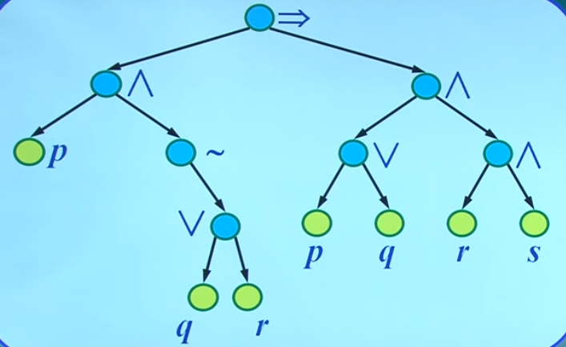
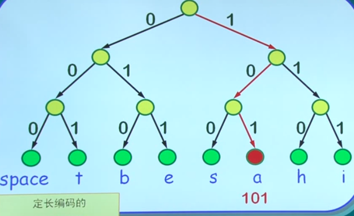
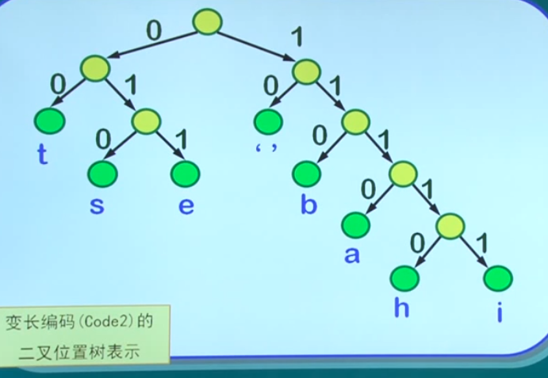

# 离散数学 8 树及其应用

## 无向树

连通且不含任何简单回路的无向图称 **无向树** 简称 **树**。树中度数为1的顶点称为 **叶子** 度数大于1的顶点称为 **分枝点**

- 一阶简单图 $K_1$ 也是树，称 **平凡树**，既无叶子又无分枝点的特殊树。
- 不含重边和自环，一定是简单图

不含任何回路的图称为 **森林**

- 每个连通分支都是树

**定理**：n阶无向连通图G的边数满足 $m = n - 1$ 则图G中至少存在两个度数为1的顶点

**定理**：设T是 (n, m)-无向图，则以下命题互相等价：

- T是树
- T的每一对相异顶点之间存在唯一的简单道路
- T不存在简单回路，但在任何两个不相邻的顶点之间加一条新边后得到的图中存在简单回路（称为“**极大无圈**”）
- T连通，但T的每一条边都是桥（称为“**极小连通**”）
- T连通且 $m = n - 1$
- T不存在简单回路且 $m = n - 1 $

**推论**：

- 任何非平凡树至少有两个叶子顶点
- 对于任何无向(n, m)-图，若图中不存在简单回路，则 $m \leq n - 1$

**定理**：

- 无向树是平面图

**定理**：

- 无向树T中有 $a_i$ 个度数为 $i$ 的顶点，则T的叶子数为 $\sum_{i = 3}(i - 2)\times a_i+2$

## 支撑树及其应用

### 最小支撑树

连通图G的支撑子图T是一棵树，称T为G的 **生成树** 或 **支撑树**。一个连通图可以有多个不同的支撑树。

**定理**：无向图G具有支撑树 iff G是连通图

**推论**：G为n阶无向连通图，则 $m \geq n - 1$

给定无向连通赋权图，该图所有支撑树中各边权值之和最小者称为 **最小支撑树 (minimal spanning tree, MST)**

### 克鲁斯卡算法

每次连通权重最小的路径，但要避免产生回路。

克鲁斯卡算法无力解决最小支撑森林的问题。

### 普里姆算法

从 $v_0$ 开始，补充成本最低的边。

普利姆算法同样无力解决最小支撑森林的问题。

### 破圈法

每次破除圈的最大权值边。

该算法不适合计算机实现，但可以解决最小支撑森林的问题。

### 博鲁夫卡算法

首先将每个顶点v作为一个连通分支，之后每一步选择最相近的两个连通分支合并，直到剩下一个连通分支为止。

博鲁夫卡算法无力解决最小支撑森林。

### 最小瓶颈支撑树和斯坦纳树

(G, W)是无向连通赋权图，G的所有支撑树中权值最大的边的权值最小的支撑树称为G的 **最小瓶颈支撑树**

**定理**：无向连通图的最小支撑树一定是最小瓶颈支撑树，但最小瓶颈支撑书不一定是最小支撑树。

无向连通赋权图 $G = ((V, E), W ), R \subseteq V$，在G的所有包含R的所有顶点的子图中，总权值最小的树称为G的 **斯坦纳树** 。是否包含R以外的点并不重要。

斯坦纳树接近最小支撑树，但事实上异常困难，属于NPC问题。

## 最短道路树
### 单源最短道路

赋权图 $(G, W)$ 图中的一条道路的的 **长度** 是该道路中个条边的权重之和

**定理**：$\pi:v_0, v_1, \cdots, v_{k-1}, v_k$ 是图G的顶点 $v_0$ 到 $v_k$ 的最短道路，则 $v_0, v_1, \cdots, v_{k - 1}$ 是 $v_0$ 到 $v_{k - 1}$ 的最短道路

**戴克斯特拉 (Dijkstra)** 给出了求唯一源点到其他各顶点的最短道路（之一）的算法

**定理**：赋权图G，v是G的一个顶点，则存在G的一棵支撑树T，使得在T中v到任意顶点u的道路，就是G中v到u的最短道路（之一）。称T为G的 **最短道路树**

**注记**：

- 算法解决已知起点问题；已知终点问题与之相同
- 算法也适用有向图，所得结果构成 **根树**
- 算法仅适用于边权为正的图

## 根树

若一个有向图在不考虑边的方向时是一棵树，则该图称为 **有向树**

有向树T恰有一个顶点入度为0.其余顶点的入度为1，则T为 **根树**，v称为T的 **根**

- 出度为0的顶点称为 **叶子**，出度大于0 的顶点称为 **分枝点**
- 只有一个孤立顶点的平凡树也是根树

**定理**：从根到其他任一顶点都存在 **唯一** 的简单道路。这是对根树的本质刻画。

**定理**：有向图T中存在顶点v，使得从v到T的任一其他顶点都存在唯一的简单道路，而且不存在从v到v的简单回路，则T是一棵以v为根的根树。

u,v是根树中两个顶点：

- 若u到v可达，则u是v的 **祖先**，v是u的 **后代**
- 若(u, v)是根树中的有向边，则称u是v的 **父亲节点** 或 **双亲顶点**，v是u的 **孩子顶点**
- 若u,v的父亲顶点相同，则称u和v是 **兄弟节点**

v是根树T中的一个顶点，v及其所有后代所导出的子图T'称为T的 **以v为根的子树**

在根树中，由根到顶点v的道路长度称作v的 **层数**；所有顶点的层数的最大值称为根树的 **高度**

#### m叉树

在根树T中，若每个分枝点的出度最多为m，则称T为 **m元树** 或 **m叉树**。若每个分枝点的出度都等于m，则称为 **完全m叉树**。进一步，若T的全部叶子顶点的层数都相同，则称T为 **正则m叉树**

#### 有序树

如果规定T中每分枝点的孩子的顶点之间的次序，则称T为 **有序树**

m叉树有序，称 **m叉有序树**。对于二叉有序树而言：

- 分枝点v的第一个孩子顶点称 **左孩子**，第二个孩子称 **右孩子**
- 以左/右孩子为根的子树称为 **左/右子树**

#### 位置树

如果m叉有序树T的每个顶点的孩子顶点都被规定了位置，则称T是 **m叉位置树** （可能只有右孩子而没有左孩子）

**定理**：T是完全m叉树，叶子数为t，分枝点数为i，则 $(m - 1)i = t - 1$

- 利用出度等于入度证明

### 双链树

任意有序树都可以转换为一棵二叉位置树。

转换方法：将每个顶点v的第一个孩子作为其左孩子，第一个兄弟作为其右孩子。又称左孩子右兄弟表示法。

有序树组成的森林也可以转换为二叉位置树。

1. 先将森林中的每一棵树表示成二叉位置树
2. 除第一棵二叉位置树外，一次将剩下的每棵二叉位置树作为左边二叉位置树的根的右子树

## 二叉树遍历

### 二叉位置树的遍历

对每一棵树的每个顶点系统地访问仅一次的方式称作树的 **遍历** 或 **周游**，也称 **书搜索**

可以根据访问各个顶点的 **次序** 进行分类。

- 前序遍历：深度优先遍历
  - 结果称 **前缀表示** 或 **波兰式**
- 中序遍历：投影
  - 
  - 对于二叉搜索树而言，其中序遍历结果正是排序结果
  - 结果称 **中缀表示**
- 后序遍历
  - 结果称 **后缀表示** 或 **逆波兰式**

### 标号树

对顶点和/或边进行标号。

L为标号集：

- $f : V \rightarrow L$
- $g: E \rightarrow L$

由前缀表示或后缀表示可以唯一重构表示运算式的有序树，但中缀表达式不行。

## 最优二叉树与霍夫曼编码

### 前缀码

设 $a_1a_2\cdots a_{n-1}a_n$ 为长度为n的符号串，称 $a_1, a_1a_2, \cdots, a_1a_2\cdots a_{n-1}$ 分别为该符号串长度为1,2,...,n-1的 **前缀**

设 $A = \{\beta_1, \beta_2, \cdots, \beta_n\}$ 为一个符号串集合，若对于任意的 $\beta_i, \beta_j \in A, i \neq j, \beta_i, \beta_j$ 互不为前缀，则称A为 **前缀码** 或 **无前缀码**。若 $\beta_i$ 都是由01组成的符号串，则称A为 **二元前缀码**。

一般，任何一个二元前缀码编码方案的二叉位置树表示中 **表示符号的顶点都一定是叶子**

令二元前缀码编码方案中包括t种符号，每种符号在消息中出现的次数为 $w_i$ ，其编码长度为 $l_i$ 则消息的总长度为 $\sum_{t = 1}^tw_i\cdot l_i$

对有t个叶子 $v_1, v_2, \cdots, v_t$ 的二叉树T而言，分别赋予它们一个权值（非负实数）为 $w_1, w_2, \cdots, w_t$。称 $W(T) = \sum^t_{t = 1}w_i\cdot l(v_i)$ 为T的 **权**，$l(v_i)$ 是 $v_i$ 的层数。

权最小的二叉树称为 **最优二叉树**

### 霍夫曼编码

最优二叉树的构造方法。

字符出现频率差距越大，霍夫曼编码优势越明显。

霍夫曼编码是用于 **无损数据压缩** 的 **熵编码算法**

**熵**：收到的每条信息的平均信息量