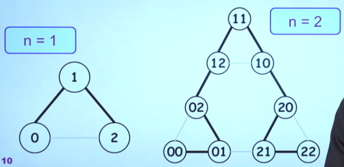

# 离散数学 专题

## 格雷码

最大码和最小码之间也只有一位不同，“首尾相连”，因此又名 **循环码** 或 **反射码**

转化：

- 二进制转格雷码：二进制码第一位不变，相邻两位 **异或运算**
- 格雷码转二进制：格雷码第一位不变，后一位与已转换的二进制码最近一位 **异或运算**

### 格雷码与超立方体图的哈密尔顿回路

**k-立方体图**：用长为k的0-1串组成的序列给顶点编号，两个定点邻接 **当且仅当** 它们的标号串  **仅在一位上数字不同**

**格雷码**： $2^n$ 个长为 n  的二进制串组成一个序列，使得 **将序列圆形排列时一对相邻的二进制串只有一位不同**，则称这个序列为 **n阶格雷码**

n阶格雷码一一对应着n-立方体图的哈密尔顿道路。$n \geq 2$，连接起点和终点得到哈密尔顿回路。

(n-1)-立方体图推广到n-立方体图的一条哈密尔顿道路：

1. (n-1)-立方体图的哈密尔顿道路经过的最左端添“0”，形成n-立方体图的一条道路$\pi_1$
2. (n-1)-立方体图的哈密尔顿道路经过的最左端添“1”，形成n-立方体图的一条道路$\pi_2$，将其反向得到$\pi_3$
3. 将$\pi_1$终点和$\pi_3$起点相连，形成n-立方体图的一条哈密顿道路

由此可以得到递归构造格雷码的方法：

1. 1位格雷码有两个码字0、1
2. n位格雷码的码字加前缀0后，顺序书写
3. n位格雷码的码字加前缀1后，逆序书写
4. 2+3得到的结果是(n+1)位格雷码


类似“镜中取反”也是 **格雷码** 被称作 **反射码** 的原因。

## 九连环

**环** 与 **钗** 在上和在下状态

允许的操作：

1. 任何时候可以改变1号环状态
   - $b_9b_8\cdots b_11 \rightarrow b_9b_8\cdots b_10$
2. 可以改变紧跟在领头环（不一定是1号环）后的环的状态
   - $b_9b_8\cdots b_i010\cdots 0 \rightarrow b_9b_8\cdots b_i110\cdots 0$
3. 1号2号环可以同时改变状态

取下n-连环的递归解法：

1. n=1，则使用操作1直接取下1号环
2. n=2，先下1号环，在下2号环
3. $n \geq 2$ 则：
   1. 使用解决(n-2)-连环的方法，取下全部环
   2. 使用操作2，取下n号环
   3. 反向使用解决(n-2)号环的方法，将其装回
   4. 使用解决(n-1)号环的方法，将(n-1)号环全部取下

**算法分析**：
$$
R(n) = R(n-2) + 1 + R(n-2) + R(n-1) \\
R(n) = \frac{2^{n+2}+(-1)^{n+1} - 3}{6}
$$
**与格雷码的联系**：

**只有一位** 的状态改变。每次求解n-连环过程中状态编码的变化是 **n位格雷码的一个连续部分**


令 $S_n$ 表示n位格雷码字11...11对应的普通二进制码的十进制数值，则可以证明：

- 只允许使用操作1和2，求解n-连环过程中的状态编码作为格雷码字对应的普通二进制码的十进制数值是从 $S_n$ 递减到0
- 转化：
  - n为奇：$S_n = \frac{2^{n+1} - 1}{3}$
  - n为偶：$S_n = \frac{2^{n+1} - 2}{3}$


## 汉诺塔

```python
def hanoi(n, source, by, dst):
    if n == 1:
        print(source, 'to', 'dist')
    else:
        hanoi(n-1, source, dst, by)
        print(source, 'to', dst)
        hanoi(n-1, by, source, dst)
```

**问题规模一定要变小**

**算法分析**
$$
T(n) = 2T(n-1) +1 \\
T(n) = 2^n - 1
$$

### 非递归算法

1. 三根柱子按顺序摆成品字形
   - n为偶数，顺时针摆放为ABC
   - n为奇数，顺时针摆放为ACB
2. 将圆盘1从现在的柱子上移动到顺时针方向的下一根柱
3. 把另外两根柱上可以移动的圆盘移到新的柱上（选择其实唯一）
4. 如果未达要求，返回步骤2

**与普通二进制码的关系**

记二进制串 $B_nB_{n-1}\cdots B_2B_1$

$\min{(k|i = B_nB_{n-1}\cdots B_2B_1, B_k = 1)}$ 表示第i步移动k号盘子

其他盘中有唯一移动可能性

最小盘总有两种移动可能性（需要约束其行为）

- n为偶数，$A\rightarrow B \rightarrow C \rightarrow A \rightarrow \cdots$
- n为奇数，$A\rightarrow C \rightarrow B \rightarrow A \rightarrow \cdots$


### 汉诺塔图

一种合法放置称为“状态”

用一个{A,B,C}上长度为n的字符串表示当前状态，串中的第i项表示第n+1-i个盘子所在的柱子标号

则：

- 将状态作为图的顶点
- 经过一次合法移动可将状态X变化为Y，则在顶点X和Y之间连一条无向边（操作是可逆的）
- 得到n个盘子的汉诺塔无向图


可以看到，各图之间具有极强 **相似性** 。n个盘的汉诺塔无向图由三个 n-1 个盘的汉诺塔无向图磊成

### 汉诺塔和格雷码

由格雷码得到的非递归算法

第i个格雷码和第i+1个格雷码的差异的位数号就是第i步移动的盘子的号码。

其他盘有唯一的移动。

最小盘有两种可能，因此约定同上。


从n位格雷码 $G_nG_{n-1}\cdots G_2G_1$ 可以得到当前n个盘子在3个柱的分布情况。

- $G_n = 0$ 表示n号盘在A柱，$G_n = 1$ 表示n号盘在C柱
- $G_{n - 1} = 0$ 表示n-1号盘在n号盘上 $G_{n - 1} = 1$ 表示n-1号盘在B柱
- $G_{k} = 0, 1\leq k\leq n-2 $ 表示k号盘子在k+1盘之上 $G_{k} = 1$ 需要具体确定：
  - 计算 $G_nG_{n-1}\cdots G_{k + 2} $ 对应的的普通二进制编码和十进制数值m，查表

**汉诺塔图与格雷码**



**三维“格雷码”**（首尾不相邻）


将底部两三角翻转，链接，得到首尾相连的三维格雷码

### 汉诺塔玩具变体

**相邻移动**


也即汉诺塔问题的 **最长路**

**循环移动**


**奇偶汉诺塔**

**双色汉诺塔**


## 裴蜀等式

### 欧几里得算法与裴蜀等式

### 凑邮资问题

*证明*：$n \geq 17 $ *时，用面值4元和7元的邮票可以支付任何n元邮资。*

证明18, 19, 20, 21为真即可。

**裴蜀等式**
$$
sx + ty = d
$$
的全体解为：
$$
\begin{cases}
s = s_0 + \frac{y}{\gcd(x, y)} \times k \\
t = t_0 - \frac{x}{\gcd(x, y)} \times k
\end{cases}
$$
定理表明，互质的正整数x，y，对N = xy - x - y，有：

- 任意小于N元的邮资，无正整数解
- 任意大于等于N元的邮资，有满足条件的解

### 分油问题

三个容器分别为a，b，c升（b > c），要将装在最大容器中的a升油中分出d升油，$a \geq b + c - 1$，$a - b - c \leq d < a$ 为一个 **(a, b, c; d) 问题**

不失一般性，假定 $\gcd(b, c) = 1$

算法1：

1. 中桶已空则从大桶将水倒满中桶。若未达目标进入2
2. 若小桶未满且中桶有水，水从中桶倒入小桶
3. 若小桶已满则把水从小桶倒入大桶。若未达目的，则返回步骤1

将中桶和小桶看做一个整体，1相当于系统中+b，3相当于系统中-c。最终在系统中留下a-d
$$
sb + t(-c) = a - d
$$
根据上一节得到的定理，方程一定有正整数解。

算法2：大桶向小桶倒，相同往中桶倒

### 登阶问题

n级台阶，每次允许向上p阶或者向下q阶。那么从地面开始，是否可以登上台阶顶部？

实际上问题比裴蜀等式复杂得多：可能超出最高级台阶限制。

**断言：**允许向上登p阶或向下q阶，。如果台阶阶数 **至少** p+q-1，则一定可以登顶。这个界是“紧的”，即使台阶阶为p+q-2时有可能无法登顶。

可将“登到第k阶（$1 \leq k \leq p + q - 1$）”这一问题转化为一个分油问题：

- $p > q$ 时，转化为只使用方法1的 (n, p, q; p + q - 1 - k) 问题
- $p < q$ 时，转化为只使用方法2的 (n, p, q; p + q - 1 - k) 问题

当台阶阶数超过p + q - 1时，如 $n = p + q - 1 + 5, 5 \leq p + q - 1$ 可以先利用第 $1~(p + q - 1)$ 阶台阶到达位置5，之后再从位置5到达位置n。相当于分油问题中先分出一些倒掉，再分出 $p + q -1$ 升油

通解：台阶阶数 $m = (p + q - 1) + s \space (s \geq 0)$

1. 利用第0阶和p + q - 1 阶，到达 s mod p
2. 向上登 $\lfloor s /p\rfloor$ 次，到达 $(s \space mod\space p )t + p\lfloor s /p\rfloor = s$
3. 从s触发登顶到达位置m

### 台球桌问题


该问题相当于求解方程 $sa + (a - x) = tb + (b - y)$。利用 $N = xy - x -y$ 公式判断知道，该方程存在非负整数解。


### 波利亚的果园

设果树半径r，确定一个实数 $\rho$ 使得

- $r \geq \rho$ 时，在果园中心无论向哪个方向看，都只能看到果树
- 当 $0 < r < \rho$ 时，至少存在从果园法术的一条射线可以穿出果园而不被果树挡住

波利亚给出的取值范围：
$$
\frac{1}{\sqrt{S^2 + 1}} \leq \rho < \frac{1}{S}
$$
与原点连线中途无其他格点的格点称 **本原格点**

- (p, q) 是本原格点 iff p，q互素
- 若 pv - qu = 1，则 (p, q) 和 (u, v) 都是本原格点，且它们由一个平行四边形相连
- 此时 (u, v) 是 (p, q)的 **左临点** (p, q) 是 (u, v) 的 **右顶点**

## 正多面体

每个面全等，每个多面角也相等。

如果可将无向图G画在平面上，使得出了端点之外，各边彼此不相交，则称G是**具有平面性的图**，或简称 **平面图**，否则称G是 **非平面图**


**欧拉公式**：设图G可以画在平面上且满足无边相交，G的边将平面划分成若干个封闭区域，则之为G的 **面**，包围面的边称该面的 **边界**，边的边界中的边数称为面的 **次数** （桥在记次数时算作两条边）

- G是一个面数为f的(n, m)-连通平面图，则 $n - m + f = 2$

**对偶图**：


正四面体是自对偶的，正六面体和正八面体是对偶的。对偶多面体的构造方法：


**对偶图**：G是一个平面图，满足下列条件的图 $G ^*$ 是G的对偶图：

- 图G中的每个面（包含外部面）内化一个顶点
- 在这些顶点之间添加边，每条新的边 **恰与G中的每一条边相交一次**
- 所得的新图即为G的对偶图 $G^*$

**图的着色**：

- 简单图G的每个顶点赋予一种颜色，使得 **相邻的顶点颜色不同**，称为图G的一种 **点着色**
- 无桥平面图G的每个面赋予一种颜色，使得 **相邻的面颜色不同**，称为图G的一种 **面着色**
- 面的颜色可以转化为对偶图的点的颜色

## 德·布鲁因专题

### 存储器轮


将 $2^n$ 个二进制数字0或1排列成圆，使得这 $2^n$ 个相邻的n元组包含所有的 $2^n$ 个n位二进制序列

可以证明有一半0，一半1 （考虑每个n元组的最后一位）

可以构造有向图，在其中寻找哈密尔顿回路：


转换数学模型，重新构造有向图


由于所有的顶点的入度等于出度，所以它是一个有向欧拉图。寻找欧拉回路，得到边的最后一位即可得到存储器轮。

**定理**：对于任意的正整数n，存在存储器轮

### 德·布鲁因有向图

图的顶点集